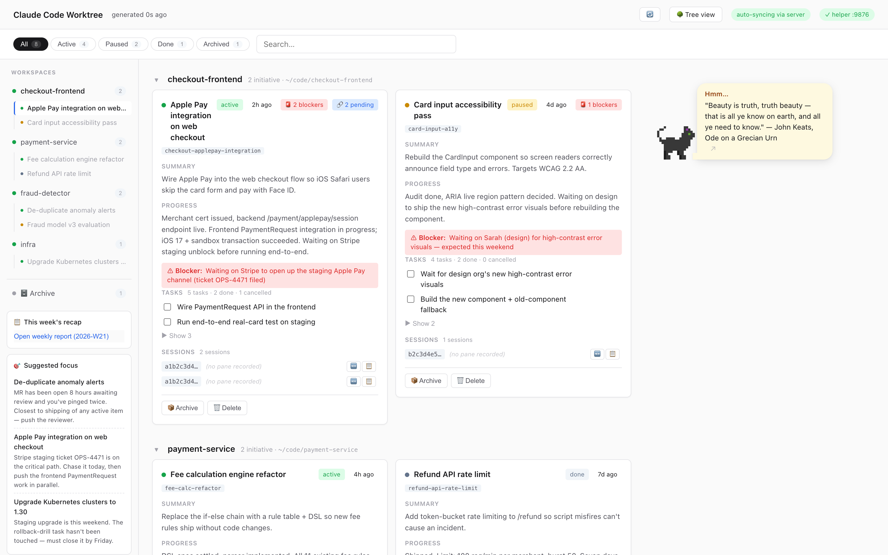
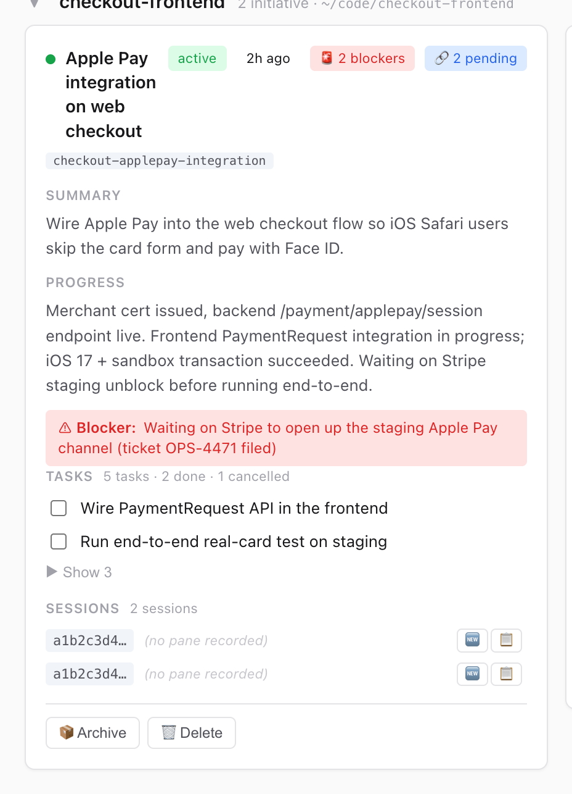
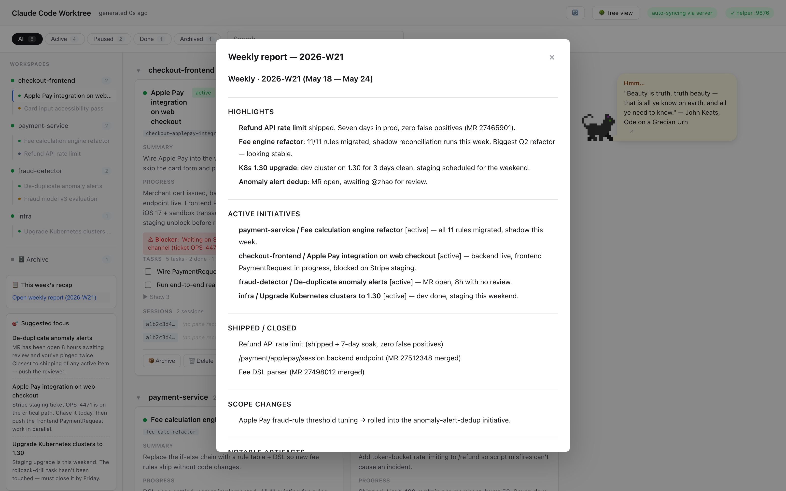
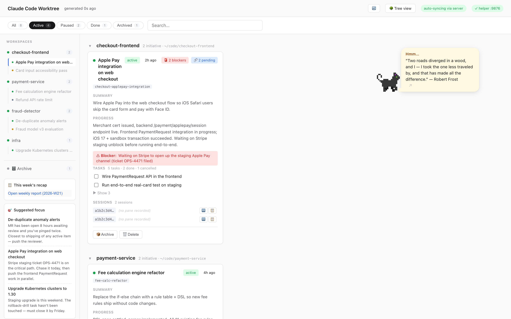

# claude-stray

**A Claude Code plugin that rescues you from session sprawl.**

You've been doing five things in Claude Code this month. Some are
merged. Some are waiting on review. Some you forgot about. Some you'll
forget about tomorrow. `claude-stray` is a tiny local dashboard that
quietly reads your Claude Code work, summarizes and classifies each
thread, and gives you back a single page where every initiative has a
card — what it's about, where it stands, what's blocked, which MR is
waiting for whom.

One-line install. No login. No data leaves your machine. Auto-syncs
your existing history on first launch, then keeps itself up to date in
the background — every time a Claude Code session ends, the matching
card refreshes.

[中文文档](docs/README.zh-CN.md) · [Architecture](docs/ARCHITECTURE.md) · [Roadmap](docs/ROADMAP.md) · [Release model](docs/RELEASE.md) · [Changelog](CHANGELOG.md)



<details>
<summary>More screenshots</summary>

| | |
|---|---|
|  | Card detail: blockers, MR/PR links, tri-state tasks, sessions to resume |
|  | Walking pixel cat + a rotating tips bubble (drag anywhere, click to cycle) |
|  | Auto-generated weekly recap, every Friday at noon |
|  | Status filter + workspace sidebar |

</details>

## What you get

A dashboard at `http://127.0.0.1:9876/` with:

- **One card per initiative** — auto-detected from your Claude Code
  sessions, with a one-paragraph summary, current status, tasks
  (pending / done / cancelled), blockers, and every MR / PR / CR /
  issue / commit it touched. Click a card to open the full detail.
- **Stable artifacts.** Once an MR is on a card, it stays there. Mark
  it merged or closed — you decide when to remove it. AI never
  silently drops links.
- **Sessions you can resume.** Each card lists the underlying Claude
  Code sessions; one click jumps you back into the conversation.
- **A weekly recap** every Friday at noon, mailed straight to the
  dashboard.
- **Next-step suggestions** — three concrete things to look at,
  drawn from your own data (not generic advice).
- **A tips bubble** with poems, programming history, and design
  trivia — every entry is source-linked. Drag the cat anywhere on
  the page, click to skip.
- **Pause / resume** the background AI any time you want, from a
  switch on the dashboard banner.

Nothing leaves your machine except the calls to Anthropic that
generate the summaries.

## Install

```bash
curl -fsSL https://raw.githubusercontent.com/Icesource/claude-stray/main/bin/quick-install.sh | bash
```

This is plain shell — Claude Code isn't involved in the install. The
script clones into `~/.claude-stray/`, sets up the slash command, the
`stray` shell wrapper, and the Claude Code hooks that keep the
dashboard fresh. Want to read it first?
[`bin/quick-install.sh`](bin/quick-install.sh).

> **About `~/.claude-stray/`.** This is the tool's own home directory
> — same convention as `~/.fzf`, `~/.nvm`, `~/.oh-my-zsh`. Don't
> `mv` it or `rm -rf` it manually; the slash command, the hooks, and
> the `stray` CLI all hold absolute paths into it. Updates are
> `cd ~/.claude-stray && git pull` (or just rerun the curl-pipe). To
> change location, use `bin/uninstall.sh` first, then reinstall with
> `INSTALL_DIR=<new path>`.

Override defaults via env vars before the pipe:

```bash
INSTALL_DIR=~/code/claude-stray \
INSTALL_REF=v0.6.1 \
LANG_CHOICE=en \
NO_SKILL=1 \
  curl -fsSL https://raw.githubusercontent.com/Icesource/claude-stray/main/bin/quick-install.sh | bash
```

### Manual install (fully transparent)

```bash
git clone https://github.com/Icesource/claude-stray.git ~/.claude-stray
cd ~/.claude-stray
bash bin/install.sh
bash bin/install-skill.sh    # optional — lets Claude Code recognize the tool
```

### After install

```bash
stray --serve
```

First launch auto-scans your Claude Code history and turns it into
cards (about 30–120 s while it summarizes). After that, every Claude
Code session you finish auto-updates the matching card in the
background — you don't need to do anything.

> **A note on installing via Claude Code prompts.** Earlier drafts of
> this README suggested pasting `Read <SKILL URL> and install it` into
> Claude Code. Claude Code (rightly) treats that pattern as a prompt-
> injection vector and refuses. The install must run in plain shell.

### Requirements

- Python 3.9+
- `claude` CLI logged in (a Claude Code Pro/Max subscription works
  fine — no separate API key needed)
- macOS or Linux (Windows via WSL)

**Optional** (the cockpit's in-card terminal degrades gracefully without them):

- `ttyd` — embed a real terminal in a card (`brew install ttyd`)
- `tmux` (or `screen`, usually preinstalled on macOS) — keep an embedded
  terminal's session alive **and repainted** across a page refresh
  (`brew install tmux`). Without it the terminal still works; it just
  re-`resume`s the session when you reload the page. (NB: `abduco`/`dtach`
  do NOT work here — they don't replay the screen, so a TUI reattaches black.)

## Usage

```bash
stray --serve              # dashboard at http://127.0.0.1:9876/  (the usual)
stray                      # terminal tree of the current cache (no AI)
stray --refresh            # re-classify now, then render
stray --cost               # today + last-7-days cost breakdown
stray --cost month         # full month
stray --diagnose [SID]     # "why doesn't session X show up?"
stray --pause "demo prep"  # pause background AI until --resume
stray --resume             # release pause
stray --weekly-report      # last week's recap
stray --next-steps         # 3 suggestions on what to focus on next
stray --help               # full flag list
```

Inside Claude Code, `/stray` renders the cached dashboard tree in the
chat. The dashboard's 🔄 button (top-right) is the everyday "refresh
now" affordance.

### First run (what to expect)

- On first `stray --serve` with an empty cache, the dashboard kicks a
  background analysis of your recent sessions. It takes ~1–2 minutes; the
  page shows a **"首次同步中…"** state and fills in as cards are produced.
- It uses a little Haiku (**~$0.3–0.5** for a handful of sessions). If the
  page shows a sync **error**, the usual cause is `claude` not being logged
  in — check with `claude -p hi`.
- Only sessions from the **last ~48h** sync on the first run (older ones
  refresh lazily when you revisit them). To pull in your full history now,
  run `stray --backfill`.

### Inside Claude Code conversations

If you ran `bin/install-skill.sh`, the main Claude Code agent learns
about stray and can answer things like:

- "What am I working on this week?"
- "How much have I spent on Claude this month?"
- "Show me what's blocked"
- "Resume my HSF MR cleanup session from Tuesday"

without you typing `stray` explicitly.

## Costs

`claude-stray` is lazy: it only calls the API when a session ends or a
scheduler tick fires. Typical per-run costs on Haiku-4.5:

| Job | When | Cost / run |
|---|---|---|
| Per-session summary | Each session ends | ~$0.04 |
| Cross-session classify | ~5×/day in active use | ~$0.17 |
| Tips refresh | Every 2 h while `--serve` is up | ~$0.08 |
| Weekly report | Fri 12:00 local | $0.10–$0.50 |
| Next-steps | After each classify | ~$0.05 |

Hard guards: 15-minute cooldown on the classify step, unchanged
sessions get skipped, and every API call goes out under a daily budget
cap.

Watch live with `stray --cost` (today + 7-day breakdown) or
`stray --cost month` for the full month.

## How it works (briefly)

Sessions Claude Code already writes to `~/.claude/projects/` get fed
through a small lazy AI pipeline that summarizes each session, groups
sessions into initiatives across days, and renders the dashboard. The
full architecture, including design notes for the artifact-stability
guarantee and the tri-state task model, lives under
[`docs/`](docs/) — start with
[ARCHITECTURE.md](docs/ARCHITECTURE.md).

## Troubleshooting

The usual suspects:

1. **Dashboard is empty** — first sync is still running; give it a
   minute. If you came from a previous install, try `stray --refresh`.
2. **A card didn't update** — Claude Code hooks may have drifted;
   `bash bin/install.sh` reinstalls them safely.
3. **Session not showing** — `stray --diagnose <sid>` walks the
   pipeline and tells you which step dropped it.
4. **Cost feels high** — `stray --cost month` for per-job breakdown;
   common culprits documented in [TROUBLESHOOTING.md](docs/TROUBLESHOOTING.md).

## Uninstall

```bash
bash bin/uninstall.sh           # default — keeps your data
bash bin/uninstall.sh --purge   # also wipes cache + session transcripts (y/N gated)
```

Default removes the slash command, the `stray` CLI wrapper, the
optional SKILL, the hook entries in `~/.claude/settings.json` (backed
up first), and any old launchd plist. Repo source, local cache, and
your Claude Code session transcripts stay put — they're your data.

`--purge` also wipes `cache/` and asks before deleting your Claude
Code transcripts.

## License

MIT — see [LICENSE](LICENSE).
