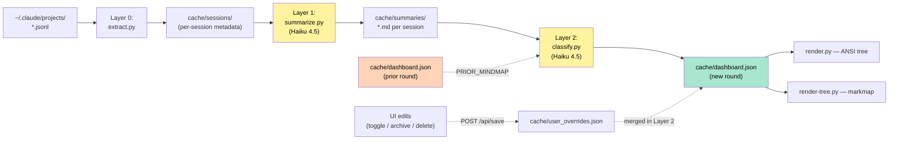
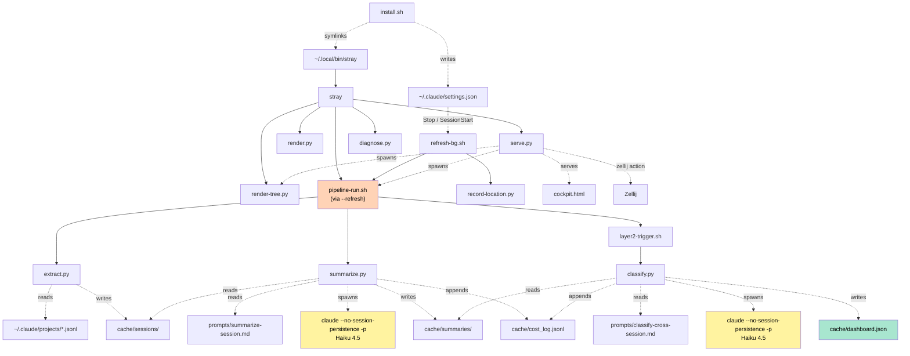
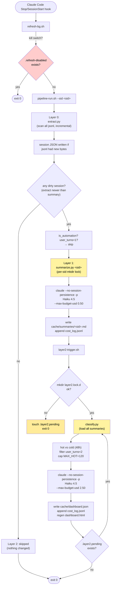
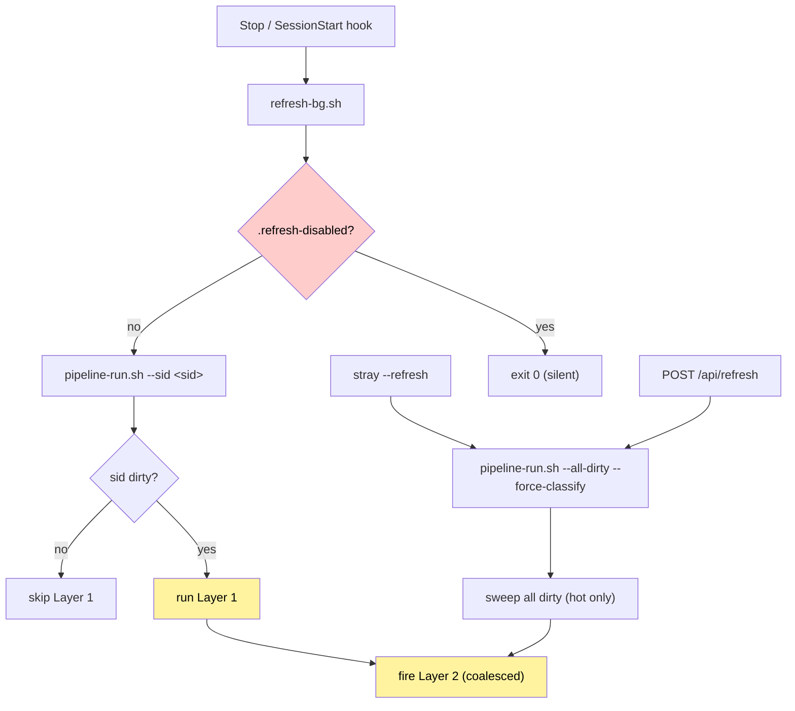
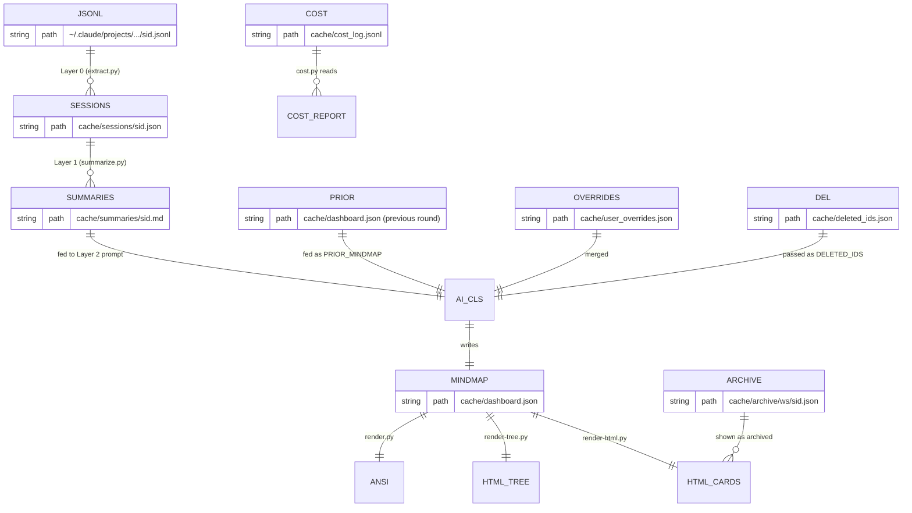
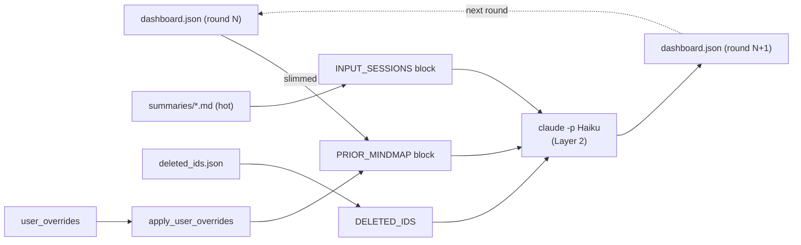
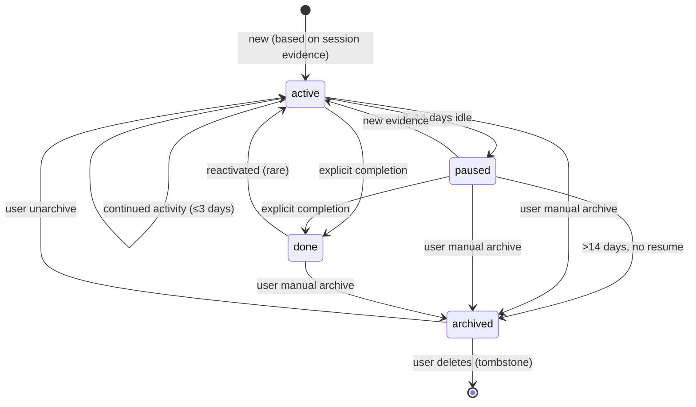

# Architecture

中文版（更详细）：[zh-CN/ARCHITECTURE.md](zh-CN/ARCHITECTURE.md)

After reading this doc you should be able to:
- Explain the tool's working principle in 30 seconds
- Locate the writer and readers of any cache file
- Trace a real user action down to the code path
- Know where to add a feature or fix a bug

> Last refreshed for the 3-layer pipeline (P14/P15). Earlier
> single-script orchestration (`refresh.sh` + `aggregate.py`) was
> retired in `2ae5071`.

---

## 1. 30-second overview

Reads `~/.claude/projects/*.jsonl` (Claude Code's own session log),
runs a **two-step Haiku 4.5 pipeline** (per-session summarize →
cross-session classify) and persists the result to `cache/dashboard.json`.
The primary surface is the **attention cockpit** (`bin/cockpit.html`,
served at `/`): a live web dashboard that bands the work by attention
state — **needs-you → running → idle → done** — driven by real-time
telemetry from Claude Code hooks, with a per-card **embedded ttyd
terminal** to resume the session in place. (`/classic` keeps the older
card grid; `stray` with no args prints an ANSI tree.) Triggered
automatically by Claude Code Stop / SessionStart hooks. Derived AI
features (tips, weekly report, next-step suggestions) are scheduled by
`stray --serve`'s in-process scheduler — they only run while the
dashboard server is up, per DD-005's lazy-refresh principle.



Compared to the old single-script architecture: Layer 0 (cheap,
byte-incremental) is decoupled from Layer 1 (per-session AI summarize,
fan-out-able) and Layer 2 (cross-session classify, coalesced). Layer 1
runs only on sessions that actually changed; Layer 2 runs only when
some Layer 1 wrote a new summary.

---

## 2. Mental model: three core concepts

| Concept | Physical form | Created by |
|---|---|---|
| **session** | One jsonl file = one Claude Code conversation | Claude Code (automatic) |
| **initiative** | Logical aggregate of one or more sessions = "one piece of work" | AI (during Layer 2 classify) |
| **workspace** | One repo/dir = container of initiatives | AI (usually the cwd) |

Example: 5 Claude Code sessions in `~/Code/hsf/hsfops`, working on
"ChangeFree refactor" and "App doc iteration":

- **workspace** `hsfops`
  - **initiative** `hsfops-changefree-cleanup` (3 of 5 sessions)
  - **initiative** `hsfops-app-doc-version-no` (2 of 5 sessions)

An initiative can span multiple cwds (e.g. one feature touching
frontend + backend + skill files). AI picks the **most semantically
fitting** cwd as primary; others go under `linked_cwds`.

---

## 3. Repository layout

```
claude-stray/
├── bin/                          # All executables
│   ├── stray                     # User-facing CLI dispatcher (bash)
│   ├── install.sh                # One-shot installer (slash + hook)
│   ├── install-hook.sh           # Re-install only the hooks
│   ├── install-skill.sh          # Install SKILL.md into ~/.claude/skills/
│   ├── uninstall.sh
│   │
│   ├── pipeline-run.sh           # 3-layer orchestrator (the "core")
│   ├── refresh-bg.sh             # Non-blocking hook wrapper around pipeline-run.sh
│   ├── live-hook.sh              # Alternative hook that pushes live telemetry
│   ├── layer2-trigger.sh         # Coalesce wrapper for Layer 2 (mkdir lock + pending marker)
│   │
│   ├── extract.py                # Layer 0: jsonl → cache/sessions/<sid>.json (incremental)
│   ├── summarize.py              # Layer 1: cache/sessions/<sid>.json → cache/summaries/<sid>.md
│   ├── classify.py               # Layer 2: cache/summaries/*.md → cache/dashboard.json
│   │
│   ├── _created.py               # DD-030: card creation registry (fcntl-locked, atomic)
│   ├── _merge.py                 # DD-031: sub-card merge orchestration (queue + landing plan)
│   ├── _pending.py               # Pending/blocked card state helper
│   ├── _subcards.py              # DD-025: sub-card registration (spawn/list/close)
│   ├── _worktree.py              # Worktree lifecycle helpers (create/clean up git worktrees)
│   ├── _lifecycle.py             # Card lifecycle transitions
│   ├── _resources.py             # Resource (MR/PR/CR/issue) link registry
│   ├── _updates.py               # Incremental card update feed
│   ├── _cost_alarm.py            # Cost/rate alarm: snapshot(), warn/halt levels (DD-004 base)
│   ├── _cost_log.py              # Shared cost-logger helper (appends to cost_log.jsonl)
│   ├── cost.py                   # `stray --cost` reporter
│   ├── live-state.py             # Live telemetry state for cockpit SSE feed
│   │
│   ├── record-location.py        # hook stdin → cache/session_locations.json
│   │
│   ├── render.py                 # dashboard.json → ANSI tree (stdout)
│   ├── render-tree.py            # dashboard.json → mindmap-tree.html (markmap)
│   ├── cockpit.html              # Primary attention cockpit UI (served at /)
│   │
│   ├── serve.py                  # Local HTTP service (127.0.0.1:9876)
│   └── diagnose.py               # `stray --diagnose`
│
├── SKILL.md                      # Claude Code skill descriptor (P11.2)
│
├── prompts/
│   ├── summarize-session.md      # Layer 1 prompt (per-session digest)
│   └── classify-cross-session.md # Layer 2 prompt (cross-session classifier)
│
├── commands/                     # /stray and /stray-refresh slash command templates
│
├── cache/                        # Runtime state, gitignored
│   ├── config.json               # {lang: zh-CN}
│   ├── dashboard.json            # Main output
│   ├── dashboard.html            # Rendered artifact
│   ├── mindmap-tree.html         # Rendered artifact (markmap)
│   ├── sessions/                 # Layer 0 output: <sid>.json per session
│   ├── summaries/                # Layer 1 output: <sid>.md per session
│   ├── state.json                # extract's per-file byte-offset table
│   ├── cost_log.jsonl            # Every AI call's cost & tokens (append-only)
│   ├── user_overrides.json       # Pending UI edits (consumed by Layer 2)
│   ├── deleted_ids.json          # User-deleted initiative tombstones
│   ├── archive/<ws>/<id>.json    # User-archived initiatives (AI never sees)
│   ├── session_locations.json    # session → zellij pane map
│   ├── .locks/<sid>.lock.d/      # Per-sid Layer 1 mkdir locks
│   ├── .locks/layer2.lock.d/     # Global Layer 2 coalesce lock
│   ├── .layer2.pending           # Pending marker (signals "re-run after current finishes")
│   └── .refresh-disabled         # If present: kill switch, pipeline does nothing
│
└── docs/                         # This dir
```

By code size: `serve.py` (largest) > `classify.py` > `summarize.py` > `render.py` > `diagnose.py` > `_merge.py` / `_created.py` / `_subcards.py` > everything else.

---

## 4. Component dependency graph

Who calls whom; who reads/writes what. **Solid = direct call**, **dashed = file-mediated**.



Two most important paths:

1. **Data collection**: `jsonl → extract.py → cache/sessions/`
2. **AI classification**: `cache/sessions/ → summarize.py → cache/summaries/ → classify.py → cache/dashboard.json`

---

## 5. Pipeline deep dive

`pipeline-run.sh` orchestrates the three layers. Layer 2 is fired via
`layer2-trigger.sh`, which coalesces concurrent triggers so the
expensive cross-session classify runs at most once per quiet period.



### Layer 0 — `extract.py`

Pure file I/O. Reads new jsonl bytes (using `cache/state.json`'s
per-file byte offset), parses each record, applies it to a
`SessionSummary` struct, atomically writes `cache/sessions/<sid>.json`.

Critical safeguard — `_is_automation_prompt`: if the first user prompt
of a session starts with one of the marker strings in
`AUTOMATION_PROMPT_MARKERS`, the session is flagged `is_automation` and
will be skipped by Layer 1. The marker list MUST include the opening
sentence of every prompt template under `prompts/` — a miss creates a
recursion loop (see DD-004 §1 and the 2026-05-14 incident).

### Layer 1 — `summarize.py`

For each session passed to it, runs Haiku 4.5 with the
`prompts/summarize-session.md` template. Output is structured YAML
frontmatter (workspace inference, status, blockers, artifacts) + a
narrative section, saved to `cache/summaries/<sid>.md`. Per-sid mkdir
lock prevents duplicate concurrent work on the same session.

`claude` flags:
- `--no-session-persistence` — critical: prevents this nested call from
  being logged as a new jsonl, which would re-trigger the hook chain.
- `--max-budget-usd 0.50` — per-call hard ceiling.
- `--disallowedTools "Bash Edit Write Read Glob Grep"` — pure text gen.

### Layer 2 — `classify.py` (via `layer2-trigger.sh`)

Reads ALL `cache/summaries/*.md`, stratifies into hot (last 48h) and
cold, applies user overrides, sends a prompt containing prior
dashboard.json + hot summaries to Haiku 4.5, writes the new dashboard.json.

`layer2-trigger.sh` coalesces fan-in: if a classify is already running,
a new trigger just `touch`es `.layer2.pending`; the running classify
checks for that marker after writing output and loops.

Both layers append to `cache/cost_log.jsonl` for the `stray --cost`
report.

---

## 6. Triggers and rate control



Core pipeline:

| Source | When | Behavior |
|---|---|---|
| `Stop` / `SessionStart` hook | Each assistant turn end / session open | `refresh-bg.sh --sid <sid>` — fork+detach, hook returns instantly |
| `stray --refresh` | User command | Forces a full sweep + classify, bypasses dirty gating on Layer 2 |
| `POST /api/refresh` | UI 🔄 button | Same as above |
| `cache/.refresh-disabled` | Manual touch / `stray --pause` | Kill switch — all hook fires exit immediately |

Derived features (DD-006, scheduled by `serve.py` while dashboard is up):

| Source | When | Behavior |
|---|---|---|
| serve scheduler — startup + every 6h | Tips for the header ticker (4 categories, AI-generated) |
| serve scheduler — piggyback on tips | Wellness signal check (zero cost when no signal fires) |
| serve scheduler — when dashboard.json mtime advances | Next-steps suggestions (30m internal debounce) |
| serve scheduler — Friday 12:00 local | Weekly report (once per ISO week) |

Earlier versions had a 2-hour launchd backup; that was removed once
the hooks proved reliable and the lazy-refresh principle (DD-005) made
"always run something in the background" an anti-feature.

There is no global cooldown gate anymore (the old `last_ai_run.epoch`
cooldown was a workaround for the single-pass architecture). Each
layer has its own gating:
- Layer 1 is dirty-gated per session (mtime compare)
- Layer 2 is coalesced via the mkdir lock + pending marker

A per-call `--max-budget-usd` is the only cost guard until DD-004's
budget circuit-breaker is implemented.

---

## 7. Cache data model



Sample contents: see the Chinese version for full JSON / MD samples
(same shape, transcribed once).

---

## 8. End-to-end walkthroughs

### Walkthrough 1: a new session becomes a card

```mermaid
sequenceDiagram
    autonumber
    actor U as User
    participant CC as Claude Code
    participant BG as refresh-bg.sh
    participant P as pipeline-run.sh
    participant E as extract.py
    participant S as summarize.py
    participant T as layer2-trigger.sh
    participant C as classify.py
    participant FS as cache/

    U->>CC: claude (open new session)
    CC->>CC: create sid.jsonl (empty)
    CC-->>BG: SessionStart hook
    BG->>FS: record-location.py
    BG->>P: fork+detach pipeline-run.sh --sid &lt;sid&gt;
    BG-->>CC: return immediately

    U->>CC: send message
    CC->>FS: append jsonl
    CC-->>BG: Stop hook
    BG->>P: fork+detach
    P->>E: extract.py (Layer 0)
    E->>FS: read new bytes, write sessions/&lt;sid&gt;.json
    P->>P: detect dirty sid
    P->>S: summarize.py &lt;sid&gt; (Layer 1)
    S->>S: claude --no-session-persistence -p (Haiku)
    S->>FS: write summaries/&lt;sid&gt;.md
    S->>FS: append cost_log
    P->>T: fire layer2-trigger.sh
    T->>C: acquire mkdir lock, run classify.py
    C->>FS: load all summaries, classify
    C->>FS: write dashboard.json, regen html
    Note over U: browser polling /api/data
    FS-->>U: new mindmap, new card visible (within 8s of classify finish)
```

### Walkthrough 2: user clicks task done in UI

Functionally unchanged from earlier — see code in `bin/render-html.py`
(client-side `task_toggles`) and `bin/serve.py` (`POST /api/save`).
Server merges overrides into the next classify run via
`apply_user_overrides()` in `classify.py`. The classify prompt's
done-monotone rule prevents AI from un-doing it.

### Walkthrough 3: `stray --serve` lifecycle

Functionally unchanged — see `bin/serve.py`. Key design points are
still:
- daemon_threads + worker-thread `shutdown()` to avoid SIGINT deadlock
- regen-on-GET keeps dashboard.html in sync without manual restart
- 8s polling on `/api/data` for silent in-place re-render

---

## 9. Continuity model: PRIOR_MINDMAP feedback loop



`prompts/classify-cross-session.md` enforces the Continuity rules:

1. **Stable id** — same work reuses the same id, even if name evolves
2. **Conservative renaming** — task titles shouldn't be casually rewritten
3. **Monotone done** — once `done:true`, stays so
4. **Cold immutability (§5)** — cold initiatives are byte-identical to PRIOR (only status decay allowed)
5. **Don't delete prior tasks** — they're history
6. **New entries justified** — must have evidence in INPUT_SESSIONS

This is exactly why "user-marked-done tasks survive AI": AI sees
`done:true` in PRIOR, the monotone rule forbids change, and post-process
in classify.py repairs it if AI drifts anyway.

---

## 10. Initiative state machine



Two kinds of `archived`:
- **AI-archived** (>14d idle) — still in dashboard.json with `status=archived`
- **User-archived** — physically moved to `cache/archive/<ws>/<id>.json`; dashboard.json no longer contains it. The HTML still shows it because `render-tree.py` and `serve.py` read the archive/ dir.

---

## 11. Concurrency and atomicity

Locking is layer-scoped, no longer global:

| Resource | Lock | Granularity |
|---|---|---|
| Layer 0 (`extract.py`) | none needed | only one process scans at a time per `pipeline-run.sh` invocation; idempotent on file content |
| Layer 1 (`summarize.py`) | `cache/.locks/<sid>.lock.d/` | per session |
| Layer 2 (`classify.py`) | `cache/.locks/layer2.lock.d/` | global (one classify at a time) |
| Layer 2 fan-in | `cache/.layer2.pending` marker | re-run after current finishes |
| `user_overrides.json` writes | none | last-writer-wins (~100ms window) |
| `_subcards.py` registry writes | `fcntl.flock` on `<file>.lock` | file-level exclusive lock |
| `_created.py` registry writes | `fcntl.flock` on `<file>.lock` | file-level exclusive lock |
| `_merge.py` queue writes | `fcntl.flock` on `<file>.lock` | file-level exclusive lock |

All mkdir locks (Layer 1/2) include stale-lock cleanup (`find -mmin +N` before
acquire) and `trap rmdir EXIT` to release on crash. The `_subcards.py` / `_created.py` /
`_merge.py` family use `fcntl.flock(LOCK_EX)` — POSIX advisory, available on macOS and
Linux. `flock(1)` (the util-linux shell command) is NOT used anywhere — it's missing on
stock macOS (lesson from P14 ship bug, [feedback_macos_portability](../../.claude/projects/-Users-bby-Code-claude-stray/memory/feedback_macos_portability.md)).

---

## 11a. Test isolation: environment overrides

All path-sensitive code (serve.py, pipeline-run.sh, _subcards.py, _created.py, _merge.py,
etc.) honours a set of environment variables that redirect to throwaway locations.
Integration tests use these to boot a fully isolated real instance without touching the
user's production cache or tmux session:

| Env var | Default | What it redirects |
|---|---|---|
| `STRAY_CACHE_DIR` | `<repo>/cache` | All cache files (dashboard.json, sessions/, summaries/, …) |
| `STRAY_PROJECTS_DIR` | `~/.claude/projects` | jsonl source directory (Layer 0 input) |
| `STRAY_PORTS` | `9876` | HTTP port for serve.py |
| `STRAY_TMUX_SOCKET` | system default | tmux server socket (isolates from real tmux sessions) |
| `STRAY_NO_BG` | unset | Set to `1` to run pipeline-run.sh in the foreground (no fork) |

`tests/test_merge_e2e.py` (DD-031 slice 5) is the reference integration test:
it sets all five overrides, boots a real `serve.py`, runs scenario flows through
the HTTP API against real git repos, and tears down cleanly. The fake `claude`
stub on PATH ensures zero AI calls during test runs.

---

## 12. Key invariants

Enforced by code or prompt. Violations are bugs.

1. `cache/dashboard.json` `schema_version == 2`
2. Every initiative has non-empty `id` and `sessions[]`
3. `sessions[]` entries are full UUIDs (classify.py post-process repairs truncation)
4. Once `done: true`, a task stays so across refreshes (Continuity rule)
5. Archived initiatives never appear in PRIOR_MINDMAP (filtered before prompt build)
6. Cold initiatives (>48h idle) are byte-identical between rounds (Continuity §5; post-process restores if AI drifts)
7. `extract.py` flags sessions whose first prompt matches `AUTOMATION_PROMPT_MARKERS` as `is_automation` — Layer 1 skips these. The marker list must include every prompt template; a miss creates self-recursion ($51 incident).
8. Layer 1 / 2 always invoke `claude --no-session-persistence -p` — without it, the nested call is logged as a new session and the hook chain recurses indefinitely.

---

## 13. Known weaknesses

### 13.1 Hot summary cap is a hard ceiling

`MAX_HOT=120` caps how many recent summaries Layer 2 sees per run. If
you have a burst day with >120 active sessions, the oldest ones fall
into "cold" territory and stop influencing fresh classification. Fine
in practice; surfaced here in case scale changes.

### 13.2 Live budget alarm — monitoring implemented, auto-engage not yet

`bin/_cost_alarm.py` is implemented and wired into `serve.py`. It reads
`cache/cost_log.jsonl` and classifies the current state as `ok / warn /
halt` based on daily spend (default: warn ≥ $2.00, halt ≥ $10.00) and
call-rate in the last 5-minute window. Thresholds are env-overridable
(`CLAUDE_WORKTREE_DAILY_WARN_USD`, `CLAUDE_WORKTREE_DAILY_HALT_USD`,
`CLAUDE_WORKTREE_RATE_WARN`, `CLAUDE_WORKTREE_RATE_HALT`). Console output
via `--watch` gives a tail-like live view.

What is **not yet implemented** (DD-004 remainder):
- Auto-engage the kill switch when the alarm level reaches `halt`.
- Dashboard banner surfacing the alarm level inline on the cockpit.
- The `/api/health` endpoint that exposes the snapshot to the UI.

Until then: the kill switch (`stray --pause` / `touch cache/.refresh-disabled`)
remains the only auto-stop mechanism. Run `stray --cost` for a one-shot
cost report.

### 13.3 No lifecycle control surface

The pipeline runs forever once installed. There's no
"pause for the weekend" or "only run when I open the dashboard". DD-005
proposes an opt-in lifecycle model.

### 13.4 Cross-host / multi-user

Loopback-only is intentional. No remote access, no collaboration, no plans to support either.

---

## 13b. Historical pitfalls absorbed from design exploration

These were discovered during the initial single-script era (2026-05) and remain
relevant to anyone extending the pipeline.

### `claude -p --bare` breaks OAuth authentication

`--bare` mode tells the Claude CLI to use only `ANTHROPIC_API_KEY` or
`apiKeyHelper` — it does **not** read the OAuth keychain. Since stray relies on
the user's Claude Code subscription (OAuth), Layer 1 and Layer 2 must **never**
pass `--bare`. Adding it produces `Not logged in · Please run /login`.

### jsonl `away_summary` field

Claude Code writes session recaps as a `system` + `subtype: "away_summary"` line
in the jsonl:

```json
{"type": "system", "subtype": "away_summary", "content": "<recap text>", ...}
```

This is the highest-fidelity recap signal and is read directly by `extract.py`.
Only ~8% of sessions have it (short sessions, old versions, or closed-recap mode
may not). The fallback is the signal-authority chain below.

### Signal authority ordering in Layer 1

When summarizing a session, `prompts/summarize-session.md` instructs the AI to
trust signals in this order (strongest first):

1. `task_events` — explicit `completed:` markers from the user
2. `edited_files` — actual Write/Edit paths; unforgeable
3. `last_assistant_summary` — most recent assistant reply opener (has the conclusion)
4. `away_summary` (`recap`) — authoritative but lags on active sessions
5. `recent_user_prompts` (last 3) — current focus
6. `first_user_prompt` — original goal, usually stale

Hardcoded rule: if any of signals 1–3 indicate something is done, never emit
`{done: false}` for that task.

---

## 14. Learning path

You've now seen the whole system. Suggested next steps:

1. **See your state**: `stray --diagnose` walks every stage and shows kill-switch / cost / hook status
2. **Trace a real session**: `stray --diagnose <sid>` to see exactly where a session is in the pipeline
3. **Read a prompt**: `cat prompts/summarize-session.md` (Layer 1) and `cat prompts/classify-cross-session.md` (Layer 2)
4. **Read a DD**:
   - [DD-002](design/DD-002-ai-pipeline-redesign.md) — why 3 layers
   - [DD-003](design/DD-003-card-detail-and-artifacts.md) — card surface + artifact extraction
   - [DD-004](design/DD-004-circuit-breaker-and-alarm.md) — proposed runaway protection
   - [DD-005](design/DD-005-lifecycle.md) — proposed lifecycle / opt-in model
   - [DD-006](design/DD-006-card-derived-ai-features.md) — proposed AI tips / weekly digest / wellness
   - [DD-007](design/DD-007-agent-auto-runner.md) — proposed card-level AI driver

Want a deeper dive on any specific component? Let me know.
