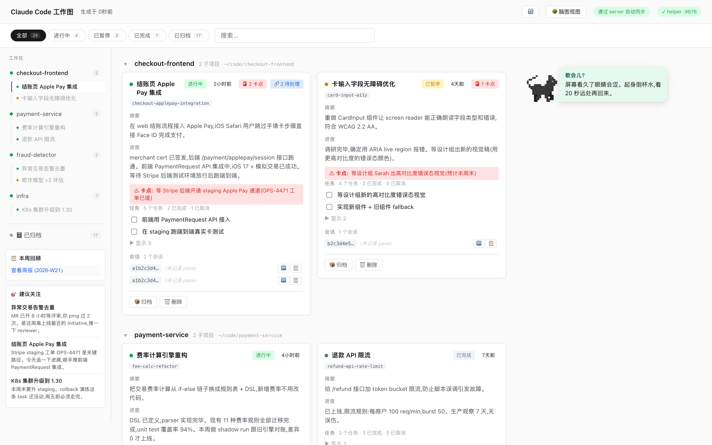
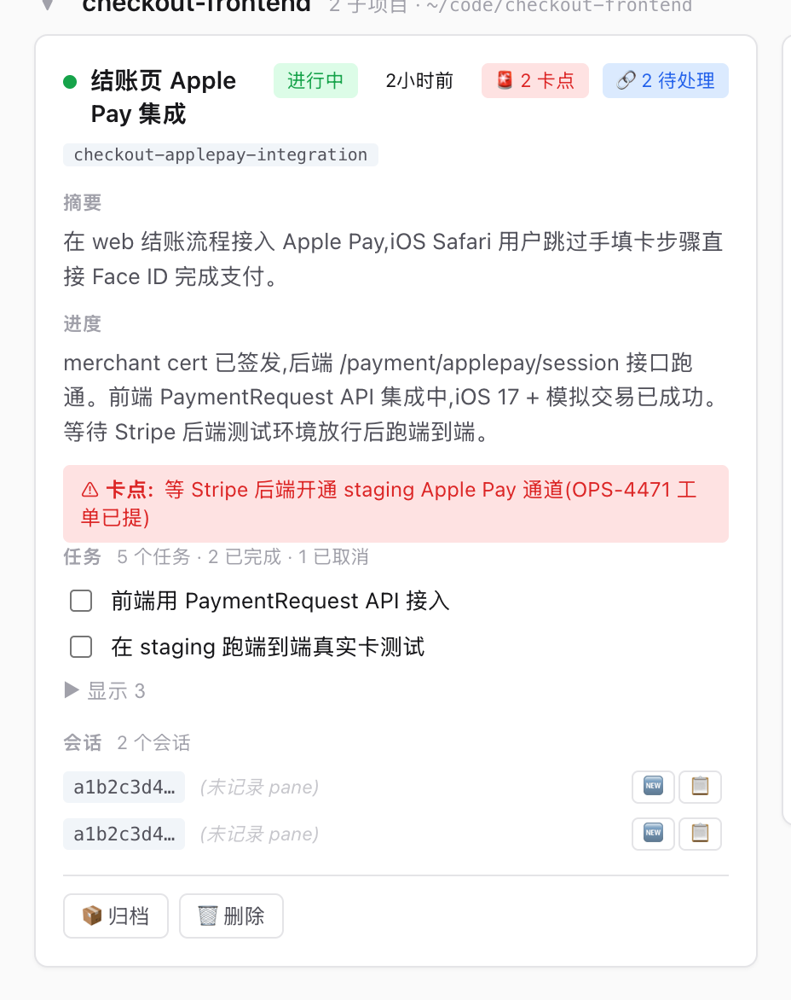
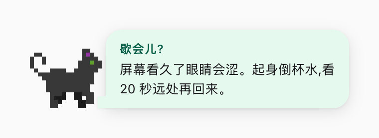
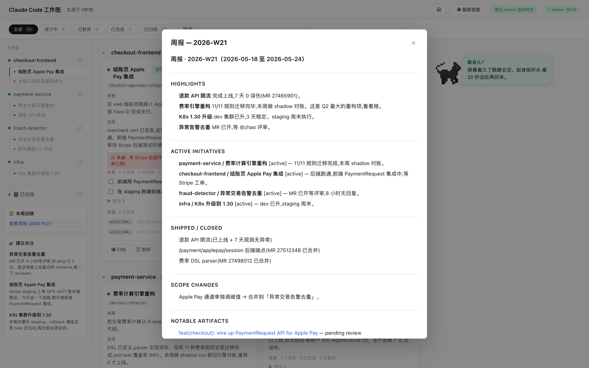
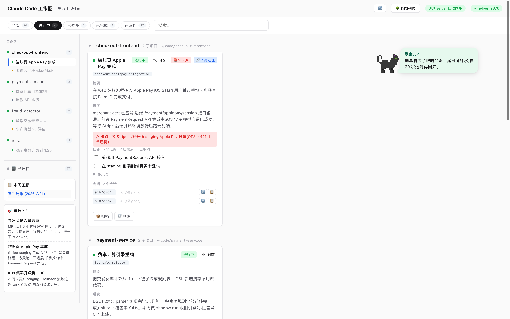

# claude-stray

**一个 Claude Code 插件，把你从会话泥潭里捞出来。**

你这个月在 Claude Code 里同时做了五件事。有些合并了，有些在等评审，
有些你已经忘了，有些明天就会忘。`claude-stray` 是一个本地小 dashboard，
它默默读取你的 Claude Code 工作记录，把每一段会话**自动总结、自动归
类**，最终给你一张页面：每件正在做的事都有一张卡，写清楚它是什么、
进展如何、卡在哪儿、哪个 MR 在等谁评审。

一行命令安装。不用登录、数据不出本机。首次启动会自动扫描你的历史
会话生成卡片，之后每次 Claude Code 会话结束都会自动更新对应卡片，
不用你管。

[English](../README.md) · [架构](zh-CN/ARCHITECTURE.md) · [Roadmap](zh-CN/ROADMAP.md) · [Release 模型](zh-CN/RELEASE.md) · [Changelog](../CHANGELOG.md)



<details>
<summary>更多截图</summary>

| | |
|---|---|
|  | 卡片详情：blocker、MR/PR 链接、三态 task、可恢复的 session |
|  | 走来走去的像素小猫 + 滚动 tips 气泡（拖到任意位置、点击切换） |
|  | 自动生成的周报，每周五正午 |
|  | 状态过滤 + 工作区 sidebar |

</details>

## 你能得到什么

一个 `http://127.0.0.1:9876/` 上的 dashboard，包括：

- **每件事一张卡** —— 从你的 Claude Code 会话里自动识别，写好简介、
  当前进展、任务清单（pending / done / cancelled）、卡点、以及涉及
  的所有 MR / PR / CR / issue / commit。点卡片看详情。
- **资产不会丢。** MR 链接一旦进了卡片，就会一直在。除非你手动点掉，
  AI 不会偷偷把它删了。可以标为 merged / closed，由你决定何时移除。
- **可恢复的会话。** 每张卡列出底层 Claude Code session，点一下就能
  回到原来的对话继续干。
- **周报**，每周五正午自动生成、自动出现在 dashboard 上。
- **下一步建议** —— 3 条基于你自己数据的具体建议（不是通用废话）。
- **Tips 气泡** —— 诗句、词源、编程史，每条都带可点击的来源链接。
  小猫可以拖到页面任意位置，点击切换。
- **AI 一键暂停 / 恢复** —— dashboard 顶栏一个开关，demo 或专注时
  段不让插件在后台跑。

除了走 Anthropic API 生成总结的网络请求，所有数据都留在你的机器上。

## 安装

```bash
curl -fsSL https://raw.githubusercontent.com/Icesource/claude-stray/main/bin/quick-install.sh | bash
```

纯 shell 脚本，**不经过 Claude Code**。它会 clone 到
`~/.claude-stray/`、注册 `/stray` slash 命令、装好 `stray` 终端命令、
以及给 Claude Code 装好让 dashboard 自动更新的 hook。想先看脚本？
[`bin/quick-install.sh`](../bin/quick-install.sh)。

> **关于 `~/.claude-stray/`。** 这是工具自己的家目录，跟 `~/.fzf`、
> `~/.nvm`、`~/.oh-my-zsh` 一样的约定。**别手动 `mv` 别 `rm`** ——
> slash 命令、hook、`stray` CLI 都把绝对路径写进里面了。升级用
> `cd ~/.claude-stray && git pull`（或重跑 curl pipe）；换位置先跑
> `bin/uninstall.sh` 卸，然后用 `INSTALL_DIR=<新路径>` 重装。

支持的环境变量（放在 pipe 前面）：

```bash
INSTALL_DIR=~/code/claude-stray \
INSTALL_REF=v0.6.1 \
LANG_CHOICE=en \
NO_SKILL=1 \
  curl -fsSL https://raw.githubusercontent.com/Icesource/claude-stray/main/bin/quick-install.sh | bash
```

### 手动安装（完全透明）

```bash
git clone https://github.com/Icesource/claude-stray.git ~/.claude-stray
cd ~/.claude-stray
bash bin/install.sh
bash bin/install-skill.sh    # 可选 —— 装 SKILL 让 Claude Code 知道这工具
```

### 装完之后

```bash
stray --serve
```

首次启动会自动扫描你的 Claude Code 历史会话、把它们转成卡片（约
30–120 秒，期间在做总结）。之后每个 Claude Code 会话结束，对应卡片
都会在后台自动更新，你什么都不用做。

> **关于"让 Claude Code 帮我装"这条路。** README 早期版本曾建议在
> Claude Code 里粘贴 `Read <SKILL URL> and install it`。Claude Code
> （正确地）把这种模式当作 prompt 注入向量，会拒绝。安装必须走 shell。

### 依赖

- Python 3.9+
- 已登录的 `claude` CLI（Claude Code Pro/Max 订阅即可，不需要单独
  API key）
- macOS 或 Linux（Windows 走 WSL）

## 使用

```bash
stray --serve              # dashboard 在 http://127.0.0.1:9876/（主用法）
stray                      # 终端树视图，零 AI 调用
stray --refresh            # 立刻重新分类后渲染
stray --cost               # 今天 + 近 7 天成本
stray --cost month         # 整月
stray --diagnose [SID]     # "为什么 session X 没出现？"
stray --pause "demo 备战"  # 暂停后台 AI
stray --resume             # 释放暂停
stray --weekly-report      # 生成上周周报
stray --next-steps         # 下一步 3 条建议
stray --help               # 全部 flag
```

Claude Code 里跑 `/stray` 把缓存 dashboard 渲染到聊天。Dashboard 右
上角的 🔄 是日常"立刻刷新"按钮。

### 在 Claude Code 对话里

如果你也跑了 `bin/install-skill.sh`，主 Claude Code agent 就会知道
stray 的存在，可以直接问：

- "我这周在搞什么？"
- "这个月在 Claude 上花了多少钱？"
- "现在哪些卡住了？"
- "继续我周二做 HSF MR 清理那次的 session"

不用显式调 `stray`。

## 成本

`claude-stray` 是懒执行的：只在会话结束或调度器到点时才调 API。
Haiku-4.5 下每次典型成本：

| 任务 | 何时 | 单次 |
|---|---|---|
| 单 session 总结 | 每次会话结束 | ~$0.04 |
| 跨 session 分类 | 活跃使用约 5 次/天 | ~$0.17 |
| Tips 刷新 | `--serve` 时每 2 小时 | ~$0.08 |
| 周报 | 周五 12:00 | $0.10–$0.50 |
| Next-steps | 每次分类后 | ~$0.05 |

硬约束：分类步骤有 15 分钟冷却、未变化的 session 直接跳过、每次 API
调用都带日预算上限。

实时查看：`stray --cost`（今天 + 7 天表）或 `stray --cost month`。

## 工作原理（简述）

Claude Code 本来就会把每次会话写在 `~/.claude/projects/` 下，
`claude-stray` 把这些会话喂给一个小型懒执行 AI pipeline：先单个 session
做总结，再跨 session 归类成 initiative，最后渲染 dashboard。完整架构、
artifact 稳定性保证、三态 task 模型等设计细节，都在
[`docs/`](.) 下；从 [ARCHITECTURE.md](zh-CN/ARCHITECTURE.md) 开始看。

## 排错

绝大多数问题就这 4 类：

1. **Dashboard 空** —— 首次同步还在跑，等一分钟。从老版本迁移来的
   话跑一次 `stray --refresh`。
2. **卡片没更新** —— Claude Code 的 hook 可能丢了；`bash bin/install.sh`
   会安全地重装。
3. **某个 session 不在** —— `stray --diagnose <sid>` 走完整 pipeline，
   告诉你哪一步丢了。
4. **成本感觉贵** —— `stray --cost month` 看分项；常见原因记录在
   [TROUBLESHOOTING.md](zh-CN/TROUBLESHOOTING.md)。

## 卸载

```bash
bash bin/uninstall.sh           # 默认 —— 保留用户数据
bash bin/uninstall.sh --purge   # 顺手清掉 cache + session 历史（y/N 确认）
```

默认清掉装到你机器上的几样东西：slash 命令、`stray` CLI wrapper、
可选的 SKILL、`~/.claude/settings.json` 里的 hook 条目（先备份）、
残留的 macOS launchd plist。**保留的**：repo 源码、本地 cache、
`~/.claude/projects/...` 下的 Claude Code 会话历史 —— 那些是你自己
的数据。

`--purge` 额外清掉 `cache/` 并询问是否删除 Claude Code 会话历史。

## License

MIT —— 见 [LICENSE](../LICENSE)。
