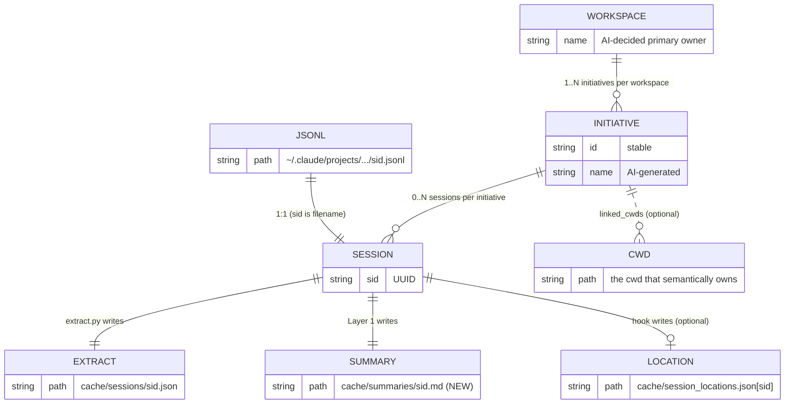
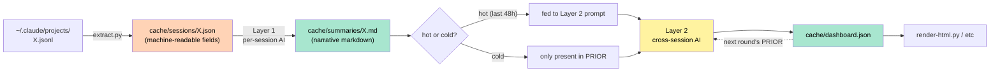
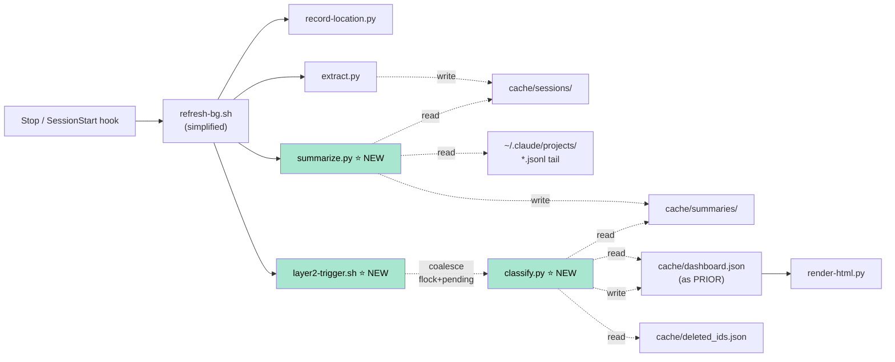
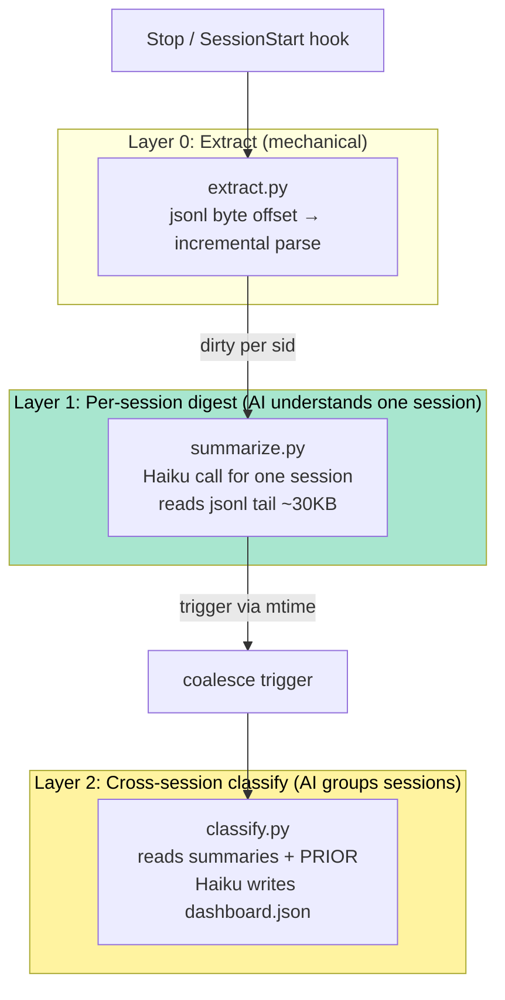
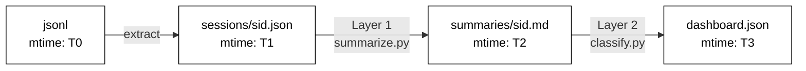
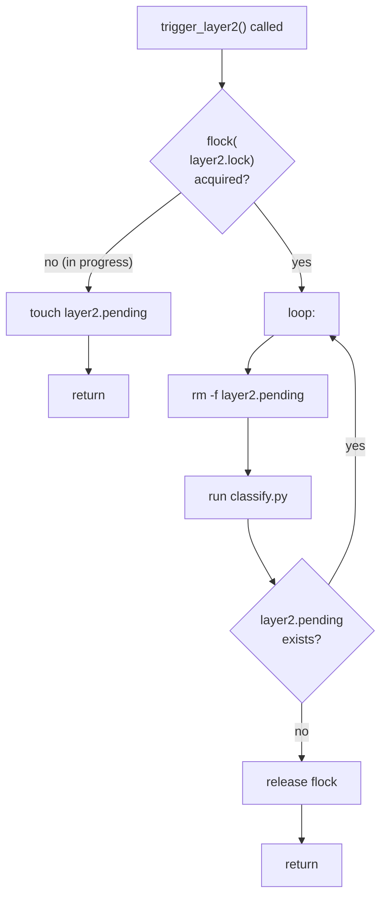
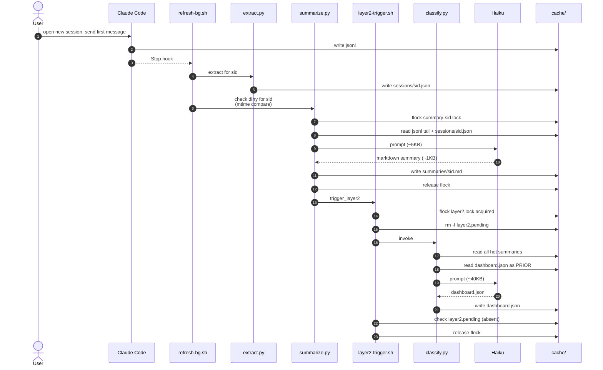
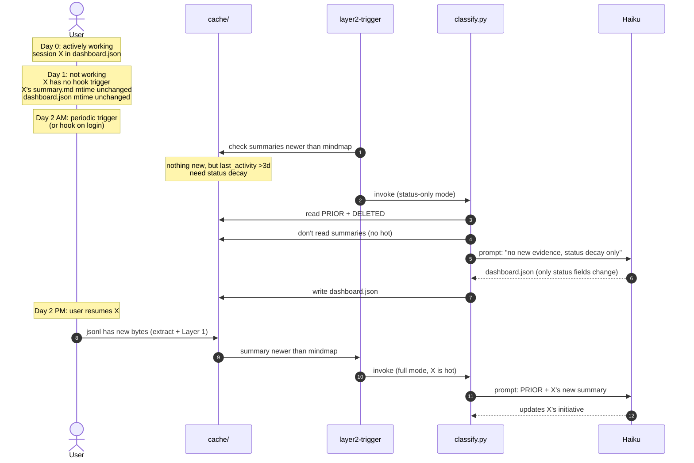
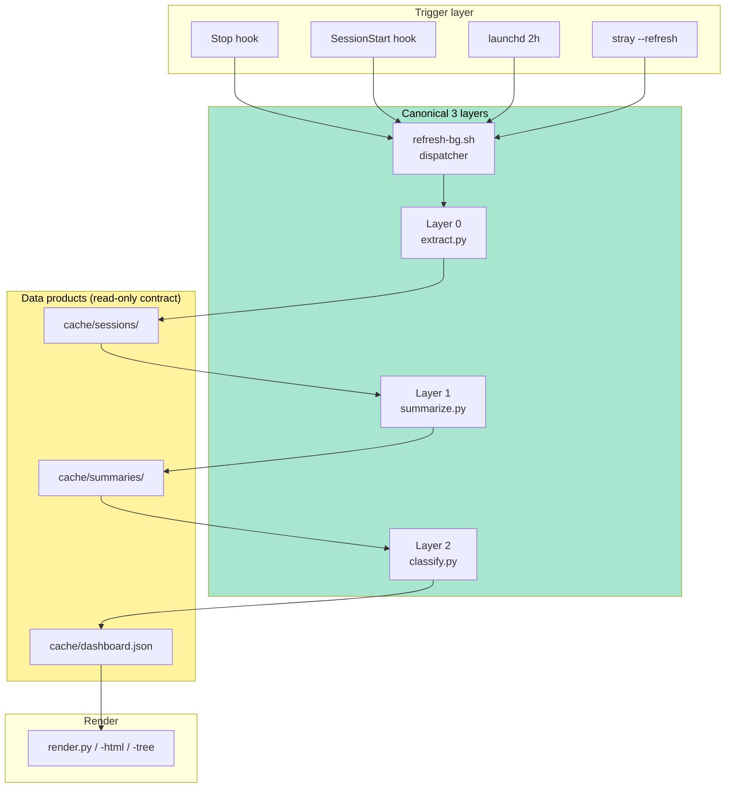
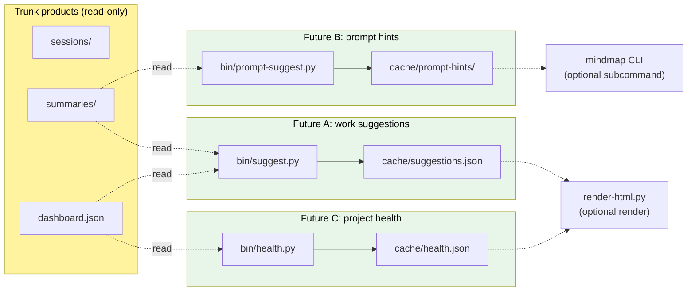

# DD-002: AI Pipeline Redesign

**Status**: Proposed
**Author**: bby
**Date**: 2026-05-14
**Supersedes**: DD-001 (two-pass classification) — DD-002 is its complete version

中文版（更详细）：[../zh-CN/design/DD-002-ai-pipeline-redesign.md](../zh-CN/design/DD-002-ai-pipeline-redesign.md)

> Unified design from P13 discussion. Covers: core abstractions, file
> layout, three-layer architecture, mtime dirty tracking, hot/cold
> stratification, concurrency model, data shapes, walkthroughs,
> migration.

---

## Contents

- [1. Problem cluster](#1-problem-cluster)
- [2. Core abstractions and mappings](#2-core-abstractions-and-mappings)
- [3. File layout](#3-file-layout)
- [4. Three-layer architecture](#4-three-layer-architecture)
- [5. Dirty tracking](#5-dirty-tracking)
- [6. Hot/cold stratification](#6-hotcold-stratification)
- [7. Concurrency model](#7-concurrency-model)
- [8. Data shapes](#8-data-shapes)
- [9. End-to-end walkthroughs](#9-end-to-end-walkthroughs)
- [10. Migration](#10-migration)
- [11. Risk & rollback](#11-risk--rollback)
- [12. Extension philosophy & contracts](#12-extension-philosophy--contracts)
- [13. Open questions](#13-open-questions)
- [14. Implementation order](#14-implementation-order)

---

## 1. Problem cluster

Four entangled problems, all rooted in **the AI being asked to do too
much, with too little context per item, on too much data, all in one
call**.

| # | Problem | Symptom | Today |
|---|---|---|---|
| A | Full-data feed | 200 sessions re-classified every refresh; ~190 untouched | `aggregate.py` treats all sessions equally |
| B | AI overload | Grouping + naming + status + tasks + continuity all in one shot | 1 prompt + Haiku must do everything |
| C | No dirty tracking | Can't tell what changed; only full recompute | Coarse `last_input.sha256` |
| D | Low information density | Each session compressed to 1.5KB; AI never sees full conversation | Lossy compression in `extract.py` |

Real impact: user spends 90 min debugging, files an ISSUE — card still
says "still on arthas watch". The information never reaches the AI.

---

## 2. Core abstractions and mappings

### 2.1 Relationships



**Key relations**:

| Relation | Cardinality | Decided by |
|---|---|---|
| jsonl ↔ session | 1:1 | Claude Code (filename = session_id) |
| session → initiative | N:1 | AI (during Layer 2 classify) |
| initiative → workspace | N:1 | AI (by semantic ownership) |
| initiative → cwd | 1 primary + N linked | AI picks the best-fitting primary cwd |

**Card** = one card in the HTML UI = one initiative's visualization. 1:1.

### 2.2 Information flow



---

## 3. File layout

### 3.1 Full structure

```
cache/                                    # All gitignored
│
├── config.json                           # {lang: zh-CN}
├── dashboard.json                          # Main output (schema v2)
├── dashboard.html                          # Render artifact
├── mindmap-tree.html                     # Render artifact
│
├── sessions/                             # Stage 0: extract output
│   ├── <sid1>.json                       # Machine-readable fields
│   ├── <sid2>.json
│   └── ...
│
├── summaries/                            # ⭐ NEW: Layer 1 output
│   ├── <sid1>.md                         # AI-written narrative
│   ├── <sid2>.md
│   └── ...
│
├── state.json                            # extract byte offsets
├── session_locations.json                # zellij pane info (from hook)
│
├── user_overrides.json                   # UI task-done flips
├── deleted_ids.json                      # User-deleted tombstones
├── archive/<workspace>/<id>.json         # User-archived initiatives
│
├── .locks/                               # ⭐ NEW: fine-grained locks
│   ├── summary-<sid>.lock                # Layer 1 per-sid flock
│   ├── layer2.lock                       # Layer 2 single-instance
│   └── layer2.pending                    # Layer 2 coalesce marker
│
└── (deprecated)
    ├── aggregate_input.json              # ❌ Layer 2 reads summaries/ directly
    ├── last_input.sha256                 # ❌ mtime compare replaces it
    ├── last_ai_run.epoch                 # ❌ no cooldown
    └── refresh.lock.d/                   # ❌ lock granularity too coarse
```

### 3.2 Mapping to components



New scripts:

| Script | Role |
|---|---|
| `bin/summarize.py` | Layer 1: read one session's jsonl tail, call Haiku, write `summaries/<sid>.md` |
| `bin/layer2-trigger.sh` | Layer 2 trigger: flock + pending file for coalesce |
| `bin/classify.py` | Layer 2: read summaries + PRIOR, call Haiku, write `dashboard.json` |

Deprecated:

- `bin/refresh.sh` shrinks significantly (no longer a monolithic orchestrator)
- `bin/aggregate.py` no longer needed

---

## 4. Three-layer architecture

### 4.1 Overview



### 4.2 Layer 0: Extract

**Unchanged in role**. Still mechanical incremental jsonl parsing
writing `cache/sessions/<sid>.json`.

**Simplification**: since Layer 1 will see the raw jsonl, extract's
heavy compression fields (`first_user_prompt`, `last_assistant_summary`,
etc.) are no longer consumed downstream. Layer 0 keeps only
**machine signals**:

```jsonc
{
  "session_id": "...",
  "cwd": "...",
  "started_at": "...",
  "last_activity_at": "...",
  "user_turns": 16,
  "edits": [{"file": "...", "kind": "create", "ops": 3}, ...],
  "tools": {"Bash": 12, "Read": 30, "Edit": 3},
  "task_events": ["created: ...", "completed: ..."]
}
```

Text content (prompts / replies) is **entirely handled by Layer 1**.

### 4.3 Layer 1: Per-session digest

**Role**: one session → one structured narrative.

**Input**:
- `cache/sessions/<sid>.json` (machine signals)
- The **tail** of `~/.claude/projects/.../<sid>.jsonl`, ~30KB
  (most recent 10 user-assistant turns, raw text)

**Output**: `cache/summaries/<sid>.md`

```markdown
---
session_id: cbbeb23c-b6f9-4eb4-926e-7e4046c856d4
cwd: /Users/bby/Code/pandora/pandora-sar/hsf
last_activity_at: 2026-05-13T09:19:46Z
user_turns: 16
updated_at: 2026-05-13T09:25:00Z
status_guess: active
---

# Goal
Trace why EagleEye span shows server IP as null in HSF; specifically
mtop-to-HSF conversion in local-call scenarios.

# Current state
Root cause identified: EagleEyeHttpHook.beforeProcess passes wrong arg
to logRemoteIp (own host IP instead of actual remote). Fix plan clear.

# Decisions made
- Modify EagleEyeHttpHook to pull remoteIp from HSFRequestContext
- Special-case mtop-uncenter (both source and target are local)

# Artifacts
- /tmp/aone-issue-hsf-eagleeye.md (created, pending submit)

# Next step
Submit Aone ISSUE assigned to self; create dev branch for fix.

# Open questions
None (fix is clear)

# Tasks (proposed)
- [x] Collect EagleEye data samples with @s0 prefix
- [x] arthas watch to grab on-site data
- [x] Identify root cause (logRemoteIp wrong arg)
- [x] Draft Aone ISSUE
- [ ] Submit ISSUE to Middleware RPC project
- [ ] Open dev branch for fix
```

**Prompt sketch** (`prompts/summarize-session.md`, ~80 lines):

```
You are reading the tail of a Claude Code session; produce structured
markdown for downstream cross-session classification.

Input:
  - SESSION_META: metadata (user_turns, edited_files, etc.)
  - TURNS: latest 10 user-assistant turns, full text

Output: strict markdown with these sections in order:
  # Goal — 1-2 sentences, why the user opened this session
  # Current state — where work stands as of the last turn
  # Decisions made — bullet list, decisions still in effect
  # Artifacts — files edited or created
  # Next step — explicit next step from user or AI
  # Open questions — pending issues
  # Tasks (proposed) — [x] / [ ] list, each ≤ 60 chars

Rules:
  - Last turn = most authoritative signal; recap and first prompt
    may be stale
  - If session is small talk ("ok", "continue"), don't force content;
    write "(no meaningful progress)"
  - status_guess inference: active (clear progress) / paused (mid-
    interrupt) / done (user confirmed shipped) / abandoned (looks
    given up)
```

**Trigger**: Stop hook → dirty check (§5) → run

**Cost**: ~$0.01 / call (Haiku, ~5KB prompt, ~1KB output, ~5-10s)

**Concurrency**: fully concurrent, per-sid flock. See §7.

### 4.4 Layer 2: Cross-session classify

**Role**: all hot summaries + PRIOR → dashboard.json.

**Input**:
- `cache/summaries/<sid>.md` for all **hot** sessions (see §6)
- `cache/dashboard.json` as PRIOR_MINDMAP (slim)
- `cache/deleted_ids.json` as DELETED_IDS

**Output**: `cache/dashboard.json` (schema v2 unchanged)

**Prompt sketch** (`prompts/classify-cross-session.md`):

```
Cross-session classification: group hot session summaries into
initiatives, maintain continuity across refreshes.

Input:
  - HOT_SUMMARIES: structured markdown summaries (from Layer 1)
  - PRIOR_MINDMAP: previous round's classification
  - DELETED_IDS: user-deleted initiative ids (tombstones)

Output: strict JSON, dashboard.json (schema v2)

Hard rules:
  1. For initiatives in PRIOR with no session in HOT_SUMMARIES (cold):
     ONLY status may change (per decay rule); name/summary/tasks must
     be preserved verbatim from PRIOR
  2. Initiative id from PRIOR must be reused; never rename id
  3. Task done=true is monotone; can't flip to false
  4. DELETED_IDS ids must never appear in output
  5. session_id must be full UUID

New initiative only when HOT_SUMMARIES provides new evidence not
belonging to any existing initiative.
```

**Trigger**: summaries newer than dashboard.json → trigger Layer 2 (§7 coalesce)

**Cost**: ~$0.05 / call (Haiku, ~40KB prompt, ~10KB output, ~30s)

**Concurrency**: single-process + coalesce. See §7.

---

## 5. Dirty tracking

Use file mtime as implicit dirty bit — no separate marker files.



Decision rules:

| Comparison | Meaning | Action |
|---|---|---|
| `T0 > T1` | jsonl has new bytes; extract lagging | Run extract |
| `T1 > T2` | session extracted but summary lagging | Run Layer 1 (per-sid) |
| `any T2 > T3` | at least one summary newer than mindmap | Trigger Layer 2 |

**Rules**:

1. **Writing the file means "I changed"** — only update mtime when
   actually writing new content. No "meaningless writes" (like just
   bumping `generated_at` field).
2. **Comparisons are free**: `os.stat().st_mtime` is POSIX-atomic,
   multi-process safe.
3. **Crash recovery**: on restart, just look at mtimes.

**Trigger pseudocode**:

```python
# Stop hook → refresh-bg.sh → for each session whose jsonl was touched:
def maybe_layer1(sid):
    extract_path = f"cache/sessions/{sid}.json"
    summary_path = f"cache/summaries/{sid}.md"
    if not exists(summary_path) or mtime(extract_path) > mtime(summary_path):
        run_layer1(sid)
        trigger_layer2()   # see §7

# layer2-trigger.sh
def trigger_layer2():
    summaries_max = max(mtime(p) for p in glob("cache/summaries/*.md"))
    if summaries_max > mtime("cache/dashboard.json"):
        run_layer2_with_coalesce()
```

---

## 6. Hot/cold stratification

### 6.1 Threshold

**Hot session**: `last_activity_at` within the past 48 hours.

**Cold session**: everything else.

48h covers ±1 day work rhythm (weekend gaps common). Configurable via
`CLAUDE_WORKTREE_HOT_HOURS=48` env var.

### 6.2 Behavior comparison

| Aspect | Hot session | Cold session |
|---|---|---|
| Layer 1 trigger | Normal (run when dirty) | Same (user doesn't touch → not dirty) |
| In Layer 2 prompt SESSIONS section? | **Yes** (summary fed) | **No** (token savings) |
| In Layer 2 prompt PRIOR section? | Yes (baseline) | **Yes** (continuity) |
| AI may modify initiative fields | name, summary, progress, tasks, status | **Only status** (decay rule) |
| In dashboard.json? | **Yes** | **Yes** (not removed) |
| In HTML cards? | **Yes** | **Yes** (status may show paused) |

### 6.3 Hard constraint: AI behavior on cold initiatives

Layer 2 prompt hammers this rule:

```
For initiatives that exist in PRIOR but have no session in
HOT_SUMMARIES (a "cold initiative"), you may **only change status**:

  - If last_activity_at < 3 days: keep active
  - If 3-14 days: change to paused
  - If >14 days with no resume signal: change to archived

name / summary / progress / tasks / sessions must be **byte-identical**
to PRIOR. You may not "polish" them.
```

### 6.4 Boundary hysteresis

Concern: a session bouncing across the 48h boundary?

**Option A (recommended)**: 48h **+ hysteresis**. Once cold, returning
to hot requires "jsonl has new bytes" (user actually working), not
just `last_activity` naturally rolling back inside 48h.

**Option B**: threshold + tolerance, e.g., "between 48h ± 4h keep
PRIOR's marker". More complex, marginal benefit.

→ Pick A.

---

## 7. Concurrency model

### 7.1 Layer 1: per-sid flock, fully concurrent

```
Two sids triggered simultaneously:
  Stop hook for sid_A ─► fork ─► flock("summary-A.lock") ─► Haiku ─► done
  Stop hook for sid_B ─► fork ─► flock("summary-B.lock") ─► Haiku ─► done
  
  Don't block each other.
```

Same sid double-fired (rare):

```
Stop hook for sid_A (1st) ─► fork ─► flock(A) ─── hold ──┐
Stop hook for sid_A (2nd) ─► fork ─► flock(A) ─── block ─┤
                                                         ▼
                                                  (1st releases)
                                                         ▼
                                                  (2nd acquires)
                                                         ▼
                                              dirty check:
                                              mtime(extract) > mtime(summary)?
                                              If 1st already wrote → skip
                                              If still dirty → run
```

Lock path: `cache/.locks/summary-<sid>.lock`, flock exclusive.

### 7.2 Layer 2: single-process + coalesce



Effect:

| Scenario | Behavior |
|---|---|
| Triggered once | Run once → pending absent → exit |
| Triggered N times during run | N touches (idempotent) → after run, see pending → run again |
| Continuous triggers | At most 1 process running; new triggers fold into next run |

**Cooldown completely deprecated**:

- Layer 1 doesn't need it: per-sid dirty check is natural rate-limit
- Layer 2 doesn't need it: coalesce is rate-limit (at most 1 process,
  new triggers queued)

Optional soft cap: Layer 2 ≤ N times per hour (e.g., 20). Real-world
active work is ~4-6/hr, so this cap rarely hits. **Don't add now**.

### 7.3 Existing locks: stay or go

| Lock | Fate | Reason |
|---|---|---|
| `cache/refresh.lock.d/` (mkdir) | **Remove** | refresh.sh no longer monolithic |
| `cache/last_ai_run.epoch` | **Remove** | No cooldown |
| `cache/last_input.sha256` | **Remove** | mtime compare replaces it |
| `cache/.locks/summary-<sid>.lock` | ⭐ Add | Layer 1 per-sid |
| `cache/.locks/layer2.lock` | ⭐ Add | Layer 2 single-instance |
| `cache/.locks/layer2.pending` | ⭐ Add | Layer 2 coalesce |

---

## 8. Data shapes

### 8.1 `cache/sessions/<sid>.json` (Layer 0 output)

**Slimmed from current** (§4.2). Only machine signals; text fields gone.

```jsonc
{
  "session_id": "cbbeb23c-b6f9-4eb4-926e-7e4046c856d4",
  "cwd": "/Users/bby/Code/pandora/pandora-sar/hsf",
  "started_at": "2026-05-13T07:30:00Z",
  "last_activity_at": "2026-05-13T09:19:46Z",
  "user_turns": 16,
  "edits": [
    {"file": "/tmp/aone-issue-hsf-eagleeye.md", "kind": "create", "ops": 1}
  ],
  "tools": {"Bash": 12, "Read": 30, "WebFetch": 2},
  "task_events": [],
  "is_automation": false
}
```

Size estimate: ~400 bytes / session (was 1.5KB).

### 8.2 `cache/summaries/<sid>.md` (Layer 1 output, ⭐ NEW)

See §4.3. Structured markdown + YAML frontmatter.

Size: ~1-2KB / session (denser, full narrative).

### 8.3 `cache/dashboard.json` (Layer 2 output, schema v2 unchanged)

No change.

### 8.4 Layer 1 prompt input

```
<instructions>
content of prompts/summarize-session.md
</instructions>

<session_meta>
{ contents of sessions/<sid>.json }
</session_meta>

<turns count="10">
latest 10 user-assistant turns, full text, in order
</turns>
```

Size: ~5-10KB. Haiku handles in one call.

### 8.5 Layer 2 prompt input

```
<instructions>
content of prompts/classify-cross-session.md
</instructions>

<context>
  <current_time>2026-05-14T10:00:00Z</current_time>
  <output_lang>zh-CN</output_lang>
</context>

<prior_mindmap>
{ slimmed dashboard.json }
</prior_mindmap>

<deleted_ids>
[...]
</deleted_ids>

<hot_summaries count="25">
  <summary sid="cbbeb23c-...">
    (full content of cache/summaries/cbbeb23c-...md)
  </summary>
  <summary sid="...">
    ...
  </summary>
</hot_summaries>
```

Size: ~40-60KB total (vs current 300KB).

**Cache-friendly ordering**: high-frequency-stable `<instructions>`
first (high cache-hit rate); `<hot_summaries>` last (changes most).

---

## 9. End-to-end walkthroughs

### 9.1 Walkthrough 1: new session becomes a card



### 9.2 Walkthrough 2: user clicks task done in UI

Unchanged user_overrides flow. Simplification: apply-overrides no
longer inline in refresh.sh; **applied at the start of Layer 2**:

```
classify.py at top:
  1. Read user_overrides.json
  2. Apply task done flips to dashboard.json
  3. Clear user_overrides.json
  4. Read the post-apply dashboard.json as PRIOR
  5. Call AI
```

This guarantees AI's PRIOR always has the user's latest intent.

### 9.3 Walkthrough 3: user takes a day off and comes back



**Key**: Day 2 AM's "status decay tick" needs someone to fire it. Two options:

- **launchd once per day** calls `layer2-trigger.sh` — simple
- **Layer 2 self-checks at start**: scan PRIOR for decay candidates,
  do it inline — no extra scheduling needed

→ Pick the latter. Each Layer 2 run does decay; cost is fixed.

---

## 10. Migration

### 10.1 Phases

| Phase | Goal | Independently shippable |
|---|---|---|
| Phase 0 | Backup current cache + write migration script | Required |
| Phase 1 | Layer 1 live (summarize.py + summaries/); Layer 2 still legacy | **Yes** |
| Phase 2 | Rewrite Layer 2 (classify.py reads summaries); keep legacy refresh.sh as fallback | **Yes** |
| Phase 3 | Enable hot/cold stratification | **Yes** |
| Phase 4 | Enable coalesce + remove cooldown / refresh.lock.d | **Yes** |
| Phase 5 | Delete legacy (aggregate.py / old prompt) | Cleanup |

Each phase: independent commit + one week baking. Any failure: git revert.

### 10.2 One-shot backfill

First switch to Layer 1 needs to backfill summaries for existing ~200 sessions:

- 200 × $0.01 = **$2 one-time**
- Add `--migrate-summaries` flag to install.sh; user triggers manually
- During backfill, dashboard.json untouched; UI shows old data
- After backfill, Layer 2 uses new summaries for first classify

### 10.3 Prompt replacement

`prompts/classify.md` not deleted; renamed `prompts/legacy-classify.md`,
kept for two weeks as fallback / comparison. New prompts:

- `prompts/summarize-session.md` (Layer 1)
- `prompts/classify-cross-session.md` (Layer 2)

---

## 11. Risk & rollback

| Risk | Impact | Mitigation |
|---|---|---|
| Layer 1 prompt quality below par | Sloppy summaries → Layer 2 classification degrades | Hand-tune prompt on 3 real sessions until subjective quality; side-by-side for one week |
| Layer 2 prompt rewrite breaks continuity | Initiative id drift, task loss | Keep legacy path for A/B; DIFF monitor id renames |
| AI mistakenly deletes cold initiative | Card disappears | Hammer rule in prompt + self-check section; mandate `preserved_cold_ids` field in output schema |
| Coalesce bug causes deadlock | Layer 2 stops triggering | flock auto-releases on crash; stale pending detection (e.g. >1h → rm) |
| Backfill too expensive or slow | $2 + 5-10 min | Allow batched backfill; Layer 2 runs even with partial summaries (sessions without summary just don't participate) |

### Rollback

Each Phase rolls back via git revert; cache schema is forward-compatible:

- summaries/ dir stays, doesn't affect legacy path
- dashboard.json schema unchanged, render works
- User-visible: rollback returns to old card quality, no data loss

---

## 12. Extension philosophy & contracts

DD-002 is not just the current pipeline; it's also the scaffolding for
every future AI feature. This section spells out the design philosophy,
core invariants, and the contract any new feature must follow.

### 12.1 Six principles

#### Principle 1: File-as-contract

Each layer produces a **stable file on disk**, not a function return
value. Downstream reads from disk, not from upstream memory.

| Benefit | Cost |
|---|---|
| Naturally multi-process safe | A bit more I/O |
| Crash-recovers automatically (mtime is state) | A bit more disk |
| Easy to debug (`cat`, `ls -lt` are diagnostic tools) | |
| Function signatures can refactor freely; file shape is the real contract | |

#### Principle 2: Single-writer per file

Each cache file has **exactly one writer script**. Any number of
readers, but only one writer.

```
cache/dashboard.json      ← classify.py (unique)
cache/summaries/X.md    ← summarize.py (unique, per-sid)
cache/suggestions.json  ← suggest.py (unique, future)
```

Reason: multiple writers = races + schema drift + ownership confusion.
Once you allow multiple writers, every future feature will want to
"just add one field," and the file becomes a stew.

#### Principle 3: mtime as universal dirty signal

Every "is X stale" decision uses `os.stat().st_mtime` comparison. **No
separate dirty-flag files**.

```
T0: jsonl mtime
T1: cache/sessions/<sid>.json mtime
T2: cache/summaries/<sid>.md mtime
T3: cache/dashboard.json mtime
```

New features should follow: use their own output file's mtime to decide
whether to re-run.

Side benefit: `ls -lt cache/` tells you the pipeline's "health" at a
glance.

#### Principle 4: Graceful degradation

Missing data product = **feature unavailable, never crash**.

| Scenario | Expected behavior |
|---|---|
| cache/dashboard.json missing | render-html shows "no data yet", suggests running refresh |
| cache/summaries/X.md missing | Layer 2 treats X as cold, no error |
| cache/suggestions.json missing | HTML doesn't render the suggestion badge, main UI works |
| New feature not installed | render-html doesn't even know about it, works normally |

#### Principle 5: Rule of Three for abstractions

**Don't extract an abstraction for one or two cases. Wait for the third
identical case.**

Why:

- With 1 case, you can't tell essence from incident
- With 2 cases, surface similarity may fool you (looks like a pattern, isn't)
- With 3 cases, essence vs incident is clearly visible

Candidate helpers:

| Candidate | Wait for N cases |
|---|---|
| `bin/_ai_call.py` (Haiku call wrapper) | 3rd Haiku-calling script |
| `bin/_dirty.py` (mtime compare) | 3rd dirty-tracking feature |
| `bin/_coalesce.sh` (flock + pending) | 3rd coalesce-needing script |
| `bin/_cache_writer.py` (atomic write) | 3rd atomic writer |

After DD-002 lands, the first two AI invocations are Layer 1 and
Layer 2. When a third appears (probably suggest.py-like), THAT's when
we extract.

#### Principle 6: Hooks as triggers, not callbacks

Stop hook, SessionStart hook should be **fire-and-forget** — return
immediately, don't wait for results.

```
hook fires → refresh-bg.sh fork-and-detach → exit (< 100ms)
                                    ↓
                       remaining Layer 0/1/2/etc. run in background
```

New features **must not block synchronously in a hook handler**. All
heavy work goes through mtime dirty tracking, async.

### 12.2 Canonical pipeline

This is the **trunk that new features must NOT modify**. New features
must hook in as **parallel branches**, never inserted into the trunk.



**Trunk invariants** (reaffirmed; cross-ref
[§12 Key invariants](../ARCHITECTURE.md#12-key-invariants)):

1. dashboard.json schema_version == 2
2. session_id is full UUID
3. Task done is monotone
4. Archived initiatives don't enter PRIOR
5. cache/last_ai_run.epoch (deprecated after DD-002) is replaced by a
   dedicated marker for "real AI ran"

### 12.3 Extension contract (six rules every new feature follows)

Any new AI feature (work suggestions, prompt hints, health checks…)
must:

| # | Contract | Concrete form |
|---|---|---|
| 1 | **Read-only on trunk products** | Read `cache/sessions/`, `cache/summaries/`, `cache/dashboard.json`; never write, never change their schema |
| 2 | **Own data product** | Write to `cache/<feature>/` or `cache/<feature>.json`; manage your own dir |
| 3 | **Own prompt file** | `prompts/<feature>.md`; never reuse or modify trunk prompts like `classify-cross-session.md` |
| 4 | **Same concurrency model** | Use DD-002's mtime dirty + flock + coalesce; don't invent new mechanisms |
| 5 | **Own cost budget** | Declare `<feature>.budget_per_hour` in config.json; don't piggyback on trunk budget |
| 6 | **Render-layer degradation** | render-html.py treats new feature as enhancement; main UI works if product is missing |

Any extension violating these six rules should be rejected in review.
If you feel strongly a contract needs breaking, **open a DD to revise
the contract first**; don't sneak it in a feature PR.

### 12.4 Hook-up examples for future features



Three concrete sketches (not in DD-002 scope, just illustrative):

**A. AI work suggestions**

```
bin/suggest.py:
  trigger: cron hourly / stray --suggest
  reads:   cache/summaries/*.md (hot), cache/dashboard.json
  prompt:  prompts/suggest.md
           "Given these initiatives, suggest 5 next-step actions"
  writes:  cache/suggestions.json
           [{init_id, priority, suggestion, rationale}, ...]
  cost:    ~$0.03/call
  render:  💡 badge on HTML card; click to expand
```

**B. Prompt suggestions**

```
bin/prompt-suggest.py:
  trigger: SessionStart hook
  reads:   cache/summaries/<related-sids>.md, cache/dashboard.json
  prompt:  prompts/prompt-suggest.md
           "Based on similar past sessions, recommend 3 prompt starters"
  writes:  cache/prompt-hints/<new-sid>.md
  cost:    ~$0.01/call
  render:  Read via /hints slash command in Claude Code
```

**C. Project health**

```
bin/health.py:
  trigger: launchd daily
  reads:   cache/dashboard.json
  prompt:  prompts/health.md
           "Score each initiative's health: blocked / slow / healthy"
  writes:  cache/health.json
  cost:    ~$0.05/day
  render:  Banner at top of HTML showing "X initiatives blocked"
```

All three obey all six contracts, don't conflict with each other,
don't depend on each other.

### 12.5 Anti-patterns (things explicitly disallowed)

| Anti-pattern | Consequence | What to do instead |
|---|---|---|
| Add new field to dashboard.json (e.g. `suggestions: [...]`) | Multi-writer race; schema bloat; parsing confusion in other readers | Write to `cache/<feature>.json`, merge at render time |
| Modify `cache/summaries/<sid>.md` to add new section | Layer 2 sees polluted data; other consumers confused | Write to `cache/<feature>/<sid>.md` |
| Reuse Layer 2 prompt + add own instructions | Prompt sprawl; Haiku output quality degrades | Independent prompt file, independent AI call |
| Directly import extract.py internals | Refactor coupling across callers | Consume via file contract |
| Add a new global lock for the new feature | Multiple concurrency models that fight | Use DD-002's flock + coalesce |
| Block synchronously in the Stop hook | Slow hook response, user-perceived latency | fork-and-detach, let mtime trigger downstream |
| Add own launchd plist | Multiple independent schedules, hard to manage | Route through refresh-bg.sh |
| Touch dashboard.json mtime | Falsely triggers Layer 2 rerun | Only touch your own product's mtime |

### 12.6 Global risks and mitigations

| Risk | Today's mitigation | Future strengthening |
|---|---|---|
| Aggregate AI cost runs away | Each layer has its own cooldown / coalesce | config.json `feature_budgets` section; over-limit refuses trigger |
| Multiple features competing for Stop hook | refresh-bg.sh is sole router | All hook config points at refresh-bg.sh |
| Data races | Single-writer principle | Enforce via review |
| Startup-order dependencies | Graceful degradation principle | Enforce via review |
| Configuration sprawl | Mix of env vars + config.json | Unify into yaml/toml on the 3rd new config need |
| Disk space | summaries/ grows over time | GC: delete summaries >30d untouched and initiative archived |
| Bursty traffic | coalesce already rate-limits | Add soft global cap (e.g. ≤50 AI calls/hr) on the 3rd high-frequency feature |

### 12.7 When to review / revise the contract

The contract isn't immutable. Consider revision when:

- **3+ features all want to do something currently forbidden** — the
  contract has a gap; add a clause
- **A contract clause has never been violated** — it may be unnecessary;
  consider relaxing
- **A new feature depends on another feature's output** — feature-to-
  feature dependency chain. First instance: allowed (B reads A's
  product, not A's internals). Second: open a DD to consider promoting
  A to "near-trunk" status
- **Anthropic API changes** (new model, new cache mechanism) — may need
  trunk refactor; review contracts at the same time

Each contract revision goes through a new DD-N flow and updates this
§12. Never modify in a feature PR.

---

## 13. Open questions

### 12.1 Aligned (from prior discussion)

| Decision | Choice |
|---|---|
| Dirty tracking | **mtime compare**, no separate flags |
| Cold session in dashboard.json | **Kept**, just not in Layer 2 SESSIONS block |
| What AI can do to cold | **Only status decay**; name/summary/tasks must stay |
| Layer 1 concurrency | **Fully concurrent**, per-sid flock |
| Layer 2 concurrency | **Single-process + coalesce** |
| Cooldown | **Fully removed** |
| Hot/cold threshold | **48h** (env-tunable) |
| Hot/cold hysteresis | jsonl must have new bytes to return to hot |

### 12.2 Pending your call

1. **Layer 1 prompt scope**: how many turns / KB? Proposed 10 turns OR
   30KB, whichever comes first.
2. **Summary markdown sections** fixed at 7? Or merge to 4 (Goal /
   State / Next / Tasks)?
3. **layer2-trigger.sh invocation point**:
   - A. After each Layer 1 completes
   - B. After all Layer 1's in this hook turn complete (single batch)
4. **Status decay location**:
   - A. classify.py scans PRIOR at start
   - B. Separate periodic maintenance script
5. **Layer 1 failure handling**: use stale summary, or write FAIL
   placeholder, or skip?
6. **Long-term cleanup of summaries/**: GC stale ones? Low priority.

---

## 14. Implementation order

By risk/cost tradeoff:

```
Step 1  Write prompts/summarize-session.md, iterate on 3 real sessions
        (Cost: ~$0.03, time: 1 hr)

Step 2  Implement bin/summarize.py (full Layer 1)
        With dirty check / per-sid flock / writes summaries/
        (Cost: half day coding)

Step 3  Backfill: Layer 1 over all existing sessions
        (Cost: ~$2 one-shot, 5-10 min)

Step 4  Write prompts/classify-cross-session.md
        (Cost: half day)

Step 5  Implement bin/classify.py (full Layer 2) + layer2-trigger.sh
        (Cost: half day)

Step 6  Side-by-side run for one week
        Both old refresh.sh and new pipeline, compare dashboard.json DIFFs
        (Cost: ~$5/day × 7 = ~$35, acceptable)

Step 7  Switch hooks to new pipeline, disable old
        (Cost: 5 min settings.json edit)

Step 8  Bake for one more week, observe

Step 9  Delete legacy (aggregate.py, refresh.sh shrink, old prompt)
```

Total: ~3 days focused coding + ~2 weeks baking.
