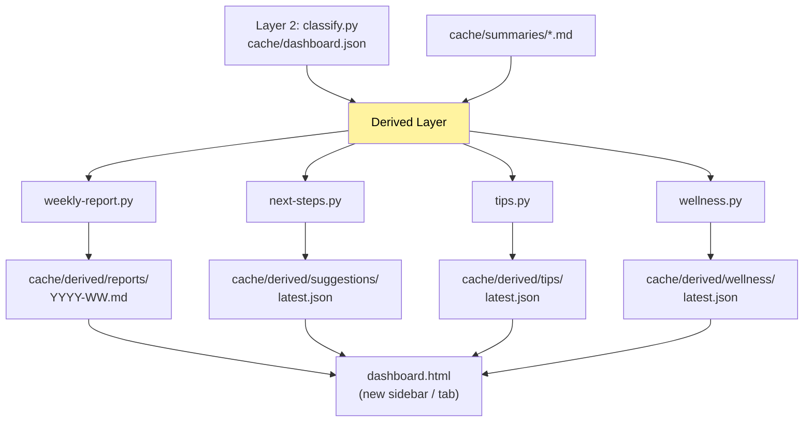

# DD-006 — Card-derived AI features

Status: **proposed** (discussion captured 2026-05-15; no work scheduled)
Predecessors: DD-002 (3-layer pipeline), DD-003 (artifacts)
Trigger: user proposal 2026-05-15 — "这些卡片是重要的数据源, 我想
基于这些数据做一些附加功能, 例如帮我生成每周的周报, AI 自动分析
工作重点, 推荐工作路径、顺序, 建议下一步做什么之类的, 一些
AI Tips, 还有一些 AI 定期生成推送的暖心的话语"

## 1 — Problem

`cache/summaries/*.md` + `cache/dashboard.json` is a rich, structured
trace of the user's work week (sessions × initiatives × artifacts ×
blockers × status × progress). Today it only feeds the dashboard.
The same data could power downstream productivity features:

| Feature                              | Anchored on                                    |
|--------------------------------------|------------------------------------------------|
| Weekly summary report                | summaries from last 7 days + initiative deltas |
| "What should I do next" suggestions  | initiative status, blockers, last activity     |
| AI-generated work-flow tips          | patterns across initiatives                    |
| Wellness nudges                      | working hours, accumulated load, blocker count |

All are pure consumers of existing data; none write back to the
pipeline's source of truth.

## 2 — Goals

1. **Read-only consumers** — these features never write to
   `dashboard.json` or `summaries/`. They produce their own artifacts.
2. **Composable** — each feature is one module that takes the same
   inputs and produces its own output. New features are additive.
3. **Cost-aware** — each feature must declare expected cost, integrate
   with DD-004's daily budget, and be skippable if the budget is tight.
4. **Local-only** — generated artifacts live in `cache/derived/` and
   are surfaced in the existing dashboard, not shipped externally.
5. **Predictable cadence** — a weekly digest runs weekly, not every
   hook fire. Tips run on a configurable schedule.

Non-goals:
- Push notifications outside the box (no email/Slack integration in
  V1)
- Multi-user collaboration features
- Cross-machine aggregation

## 3 — Architecture

### 3.1 — Layer 3: "Derived insights"

A new layer sitting above Layer 2. Each feature is a separate Python
script in `bin/derived/` that reads from cache and writes to
`cache/derived/<feature>/<artifact>.json|.md`.

### 3.2 — Scheduling

Each derived feature declares its trigger:

| Feature        | Trigger                       | Where to wire    |
|----------------|-------------------------------|------------------|
| weekly-report  | Cron: Sunday 18:00 local      | LaunchAgent      |
| next-steps     | On classify finish (debounced) | layer2-trigger.sh end |
| tips           | Daily 09:00 local             | LaunchAgent      |
| wellness       | Daily 21:00 local             | LaunchAgent      |

Each script's first action: read its own `last_run` timestamp and skip
if not due. Idempotent.

### 3.3 — Cost discipline

Each derived run logs to `cache/cost_log.jsonl` with `layer: derived.<name>`.
DD-004's daily budget includes these. If the budget is hot, derived
runs are skipped first (Layer 1/2 are higher priority because they
power the dashboard's core).

## 4 — Features in detail

### 4.1 — Weekly summary report

**Input**: all `cache/summaries/*.md` with `last_activity_at` in the
last 7 days + `cache/dashboard.json` diff between week start and week
end (cached via `cache/derived/reports/week-anchor.json`).

**Prompt**: "Given these sessions and initiative changes for the week
of YYYY-WW, generate a 1-page report covering: top 3 themes,
shipped/finished items, blockers that persisted, suggested focus next
week. Markdown, no preamble."

**Output**: `cache/derived/reports/YYYY-WW.md`

**Surface**: dashboard sidebar shows a "📋 This week's report" link;
clicking opens a modal with the markdown rendered. Also accessible
via `stray --weekly` on the CLI.

**Cost**: ~$0.20 per week (Haiku, ~30 summaries × small prompt).

### 4.2 — "What's next" suggestions

**Input**: `cache/dashboard.json` filtered to active/paused initiatives
+ each initiative's blockers + age-of-last-activity.

**Prompt**: "Given these in-flight initiatives, identify 3 that the
user should focus on next, and for each say why (recent momentum,
blocking other work, deadline pressure, low-effort high-value). Avoid
ones with external blockers. Return JSON array."

**Output**: `cache/derived/suggestions/latest.json`

**Surface**: top-left sidebar widget "🎯 Suggested focus" with 3
clickable cards, each linking to the underlying initiative card.

**Cost**: ~$0.05 per run. Triggered after every classify finish,
debounced to once per 30 minutes max.

### 4.3 — AI tips

**Input**: patterns derived from `cache/dashboard.json` and
`cache/summaries/*.md` — e.g., "5 initiatives in `paused` state with
blockers older than 7 days", "3 initiatives all blocked on the same
reviewer", "you average 4 sessions/day but only 2 initiatives close
per week".

**Prompt**: "Given these patterns of the user's work, suggest one
specific, actionable tip. Be concrete (reference the data); avoid
generic advice. 1–2 sentences max."

**Output**: `cache/derived/tips/latest.json` — rotating list of last
10 tips, each with `generated_at`, `pattern`, `tip`.

**Surface**: small "💡 Tip of the day" widget in the dashboard footer.
Dismissible.

**Cost**: ~$0.03 per run.

### 4.4 — Wellness nudges

**Input**: session timestamps from `cache/sessions/*.json` over the
last 7 days. Compute: late-night sessions (>22:00), consecutive
working days, total session duration, weekend activity.

**Logic**:
- If late-night sessions ≥ 3 in last 7d → nudge about sleep
- If 7 consecutive working days → nudge about rest
- If average daily duration > 10h → nudge about pace
- If no signals → skip (don't generate a generic message)

**Prompt** (only when a signal fires): "The user has [specific
pattern: 5 late-night sessions this week, last one ended at 02:30].
Write a short, warm, *non-preachy* message reminding them that
sustainable pace matters. Avoid clichés. 1–2 sentences."

**Output**: `cache/derived/wellness/latest.json`

**Surface**: appears as a soft toast notification on dashboard open
when fresh; auto-dismisses; archived to a hidden "wellness log" tab.

**Cost**: ~$0.02 per run; many runs will skip the AI call entirely
(no signal fired).

## 5 — Privacy / safety

These features process the same data already in `cache/`. Nothing
leaves the machine. Output artifacts stay under `cache/derived/`.
Users can `rm -rf cache/derived/` at any time without breaking the
core pipeline. The dashboard gracefully hides widgets when their
underlying file is missing.

For the wellness feature specifically: it should *not* nag. The
trigger thresholds (3+ late nights, 7+ consecutive days) are
intentionally high. If a feature is fired too often, users will
dismiss it as noise and lose trust.

## 6 — Open questions

1. **Language**: report/tips/wellness all in user's `config.json.lang`
   (zh-CN or en). Trivial to support, but: should we let the user
   override per-feature ("technical work in en, wellness in zh-CN")?
2. **Persistence of report archive**: keep last 12 weeks? 52? Forever?
   Small markdown files, leans "keep forever". User can delete.
3. **Manual override for "what's next"**: should there be a "shuffle"
   button that re-runs the suggestion immediately? Or a "I disagree
   with this suggestion" feedback that influences next round?
4. **Wellness model fit**: Haiku is fine for short kind messages but
   may sound mechanical. Worth A/B-testing one or two manual seed
   examples vs Haiku output before shipping.
5. **Should the report be emailable?** Out-of-scope V1, but if we add
   it later, mailto: link with the markdown body is the simplest path.

## 7 — Out of scope (deliberate)

- **Push to external services** (email, Slack, calendar) — V1 is
  local-only.
- **Cross-week comparison reports** ("week-over-week velocity") —
  needs a longer dataset; revisit after 4–8 weeks of usage.
- **Automatic time tracking** — we don't track keystroke-level time,
  only session timestamps; "you worked 9 hours" claims would be wrong.

## 8 — Plan (when scheduled)

| Phase | Item | Estimate |
|-------|------|----------|
| 1     | `bin/derived/_shared.py`: common load helpers, last-run gating, cost logging | small |
| 2     | `bin/derived/weekly-report.py` + dashboard sidebar link | small |
| 3     | `bin/derived/next-steps.py` + dashboard widget | small |
| 4     | LaunchAgent entries for weekly + daily schedules | tiny |
| 5     | `bin/derived/tips.py` + dashboard footer | small |
| 6     | `bin/derived/wellness.py` + signal computation + toast UI | medium |
| 7     | Settings UI to enable/disable individual derived features | small |
