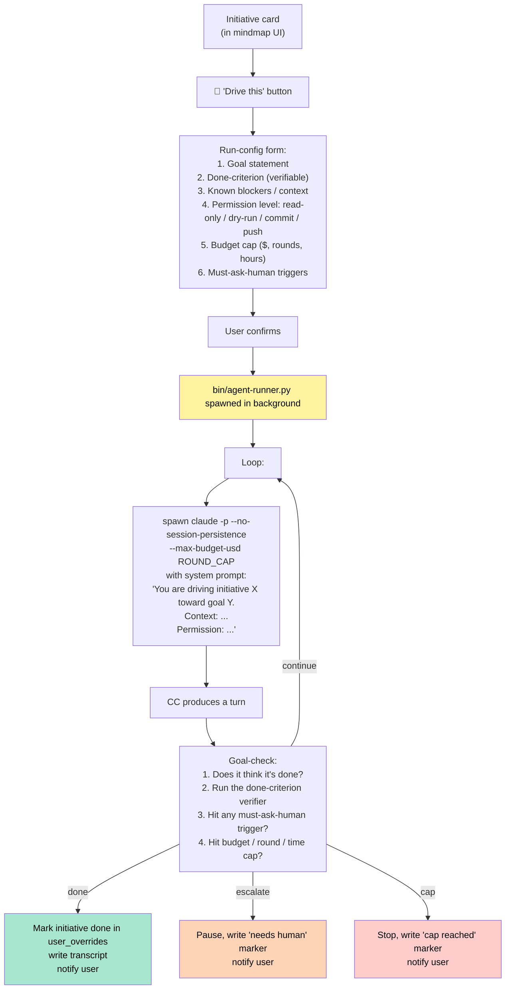

# DD-007 — Card-driven AI agent auto-runner

Status: **proposed, idea-stage only — needs research + POC before
committing to design**
Predecessors: DD-002 (3-layer pipeline), DD-003 (artifacts), DD-005
(lifecycle), DD-006 (derived features)
Trigger: user proposal 2026-05-15 — "在卡片上加一个按钮, 点击后让一
个 AI 代理人自动帮你推进该工作（主要就是一直与 ClaudeCode 对话, 直
到达成最终目标）"

> This is the highest-risk and most R&D-heavy of the proposed
> features. The doc captures the idea + the questions that need
> answers before we commit to an architecture, not a finished spec.

## 1 — The user's pitch

"Every initiative needs me to talk to Claude Code step-by-step. CC
keeps stopping to ask me to confirm things. An AI agent could just
keep talking to CC for me, driving toward a defined goal."

The user's own listed concerns:
- The agent might "go off the rails" without confirmation
- Information may be insufficient and the agent has to give up
- → mitigation: define the goal + known blockers + context UP FRONT
  when creating the agent run

## 2 — Why this is hard (the parts the user didn't list)

This is not "wrap claude -p in a loop". The hard problems are:

### 2.1 — Permission surface

The agent uses the same Claude Code with all tools enabled. Without
guardrails it could:
- `git push --force`
- Delete files / drop database tables
- Send messages via plugin tools (Slack, email)
- Run arbitrary `Bash` commands

The current human-in-the-loop is what stops these. "Agent decides on
its own" replaces that with policy. Policy needs to be explicit per
run.

### 2.2 — Stopping conditions

When does the agent stop?
- Goal achieved (and how does it know?)
- N rounds reached
- $X spent
- Stuck (no progress in K rounds)
- User-interrupted
- Encountered a blocker that's in the agent's "must-ask-human" list

All five must be implemented; ANY ONE failing means runaway.

### 2.3 — Goal-achieved detection

This is the hardest. "Refactor the ChangeFree logic" — when is it
done? "All tests pass"? "MR opened and approved"? "Approved AND
merged"? The user must declare a *measurable* completion criterion.
The agent must be able to check it (run tests, hit an API, inspect
git state).

### 2.4 — Hook recursion (again)

Same problem family as DD-002's self-recursion. Each agent round
spawns a CC session. Each CC session fires Stop hooks. The hooks
trigger the mindmap pipeline. The pipeline runs Layer 1/2 on the
agent's own session. The summaries get fed back to the dashboard,
which the agent might then read... potentially endless.

Defense: agent sessions must be flagged as `is_agent_run` from the
start; extract.py respects this as a hard filter (similar to
`is_automation` but operationally distinct).

### 2.5 — Identity and audit

If an agent commits to git, the commit author is the user. If an
agent posts a comment to a PR, it's under the user's identity. This
needs to be made visible in every artifact:
- Commit messages prefixed `[agent-run: <run-id>]`
- PR comments prefixed `🤖 Auto-driven by claude-stray`
- A separate audit log: `cache/agent-runs/<run-id>/transcript.jsonl`

### 2.6 — Resumability

A run takes minutes to hours. If the user kills the agent mid-run,
or the laptop sleeps, what happens?
- Soft pause: leave state in `cache/agent-runs/<run-id>/state.json`,
  resumable via `stray --agent-resume <run-id>`
- Hard kill: agent dies, transcript preserved, partial work commits
  remain. User cleans up manually.

## 3 — Architectural sketch (not a spec)



### 3.1 — Run config (the contract)

Before starting, the user fills in (UI form or YAML):

```yaml
run_id: 2026-05-15-hsfops-changefree-cleanup-001
initiative_id: hsfops-changefree-cleanup
goal: |
  Land the ChangeFree v2 refactor: data-flow rewrite complete,
  regression tests pass, MR opened and reviewer assigned.
done_criterion:
  type: composite
  all_of:
    - cmd: "cd ~/Code/hsf/hsfops && ./gradlew test"
      expect_exit: 0
    - file_exists: "src/main/java/.../ChangeFree2.java"
    - mr_status:
        url: "https://code.alibaba-inc.com/.../mr/12345"
        state: "open"
        reviewer: "any"
known_blockers:
  - "ChangeFreeV2 spec is in docs/spec.md — read it first"
  - "Don't touch src/main/java/legacy/* — that's owned by another team"
permission:
  read: any-path-in-cwd
  edit: any-path-in-cwd
  bash: ["./gradlew test", "./gradlew check", "git *"]
  git_push: false
  external_calls: false
caps:
  budget_usd: 5.00
  rounds: 30
  wall_clock_min: 90
must_ask_human:
  - "Before any commit"
  - "Before opening or commenting on any MR"
  - "If asked to modify schema/migrations"
```

### 3.2 — Per-round prompt structure

Each round, the agent runner builds a CC prompt:
1. System prompt: role, goal, done-criterion, permission, must-ask
   list (above).
2. Prior context: last 3 rounds of summary (running compression).
3. Current state: git status, last test run result, last error.
4. The agent's instruction: "Decide your next concrete step toward
   the goal. Output: JSON `{step: "...", reason: "...",
   tools_needed: [...], expected_outcome: "..."}` then EXECUTE the
   step via CC tools. After executing, output a brief progress note."

The agent runner parses the output, checks the run-config, decides
whether to loop / stop / escalate.

### 3.3 — Where it lives

```
bin/
  ├── agent-runner.py             # core loop
  ├── agent-prompts/
  │   ├── system.md               # per-round system prompt template
  │   └── progress.md             # progress-check sub-prompt
  └── mindmap                     # add `--agent-start / --agent-status / --agent-stop`
cache/
  └── agent-runs/
      └── <run-id>/
          ├── config.yaml
          ├── state.json          # round counter, budget consumed, status
          ├── transcript.jsonl    # every round's input/output
          └── done-checks/
              └── *.log           # output of each criterion check
```

## 4 — Key risks and proposed mitigations

| Risk                                 | Mitigation                                                                     |
|--------------------------------------|--------------------------------------------------------------------------------|
| Agent makes uncontrolled git push    | Default `git_push: false`; explicit per-run opt-in; pre-push hook double-checks |
| Agent commits secrets                | Pre-commit hook scans diff for high-entropy strings; abort if found            |
| Agent loops in circles               | Stuck detection: hash last N progress notes; if same hash 3× in a row → escalate |
| Agent hallucinates done              | Done-criterion is *verifier-executed*, not agent-declared                      |
| Wrong file edits                     | Optional `git_dry_run: true` — run in worktree, present diff to user before merge |
| Recursion via Stop hooks             | `cache/agent-runs/<run-id>/active` marker; refresh-bg.sh checks and skips Layer 1 for any session under it |
| Cost runaway                         | Hard caps in config + DD-004 budget enforcement                                |
| Identity blur in artifacts           | Auto-prefix commits / PR comments; agent transcript stored locally for audit  |

## 5 — Why this needs a POC before designing more

Several of the design choices above are guesses:

1. **Is per-round prompt rebuilding the right shape?** Or should we
   use CC's `--resume` to keep state inside CC and just feed
   instructions? `--resume` may also help with context cost.
2. **How does CC behave when a non-human drives it?** Anecdotally CC
   does very well; but the "stops to ask the user" pattern is exactly
   what the agent has to work around. We need to measure: how often
   does CC stop, what does it usually ask, can we always answer with
   "yes proceed within the permission contract"?
3. **What does "goal-achieved" feel like to run?** A POC on one real
   initiative will teach us 10x more than this doc.
4. **What does the failure mode look like in practice?** Does the
   agent flail and burn $5 of budget, or does it get stuck cleanly
   and escalate? We need data.

**Recommended POC** (~1 week of work):

- Pick one in-flight initiative with a *clean, verifiable*
  done-criterion (test passes / file exists). E.g., "rename module
  Foo → Bar" or "add a CLI flag to script X".
- Build a minimal `agent-runner.py` that loops claude -p with no UI,
  no caches, no fancy permission model — just goal + done-check +
  hard caps.
- Run it. Watch what happens. Capture transcript, cost, time-to-done,
  rounds, escalation count.
- Write a post-POC notes file (DD-007.5 or similar) before designing
  the full feature.

## 6 — Open questions to revisit after POC

1. Do we use the Agent tool (a sub-agent in the parent CC session) or
   spawn fresh `claude -p` processes? The Agent tool gets us natural
   isolation but constrains the loop shape. Fresh processes give full
   control but require more glue.
2. Should the agent run in a git worktree by default to isolate
   uncommitted changes from the user's working tree? This is a strong
   safety net but adds setup latency.
3. Where does the human approval gate live for "must-ask-human"
   triggers? A push notification? A dashboard modal? A blocking CLI
   prompt the agent waits for? All three are feasible; UX is
   different.
4. Is there a useful "co-pilot mode" where the agent proposes the
   next step and the user just hits "yes/no/edit" — i.e., NOT full
   auto-drive but reduced friction? This might be a smaller, more
   useful product than full autonomy.
5. How to handle "the goal is fuzzy" — most real initiatives don't
   have a clean done-criterion. Do we refuse to run, ask the user to
   sharpen it, or accept fuzzy goals at the cost of unreliable
   completion?

## 7 — Out of scope (deliberate, even at full design)

- **Multi-agent coordination** (multiple agents driving multiple
  initiatives in parallel) — solve single-agent first.
- **Agent learns from past runs** — interesting but separate scope.
  V1 has no memory across runs.
- **Marketplace of agent prompts** — too far ahead.
- **Agent that talks back to the human conversationally** — V1 emits
  status updates, doesn't chat.

## 8 — Plan (only after POC)

To be written after the POC produces data. Estimated structure:

| Phase | Item |
|-------|------|
| 0     | POC (above) — out of scope of this doc's commit |
| 1     | Run-config schema + validator + form builder |
| 2     | `agent-runner.py` core loop (no UI yet) — runnable via CLI |
| 3     | Done-criterion verifier framework (cmd / file / API / mr-status types) |
| 4     | Stuck detection + escalation marker + "needs human" UX |
| 5     | Dashboard integration: button, status pill, transcript viewer |
| 6     | Permission model + pre-commit / pre-push guards |
| 7     | Agent-aware filters in extract.py / refresh-bg.sh / DD-004 budget |

## 9 — Closing note

This is the most exciting and most dangerous of the proposed features.
The user said it's an idea, not researched, no POC. **Treat it like
that.** Don't add half-built scaffolding for this to the codebase
until we have at least one successful POC run on a real initiative.
The right next step is a one-week POC against a small, well-defined
target — not detailed design.
