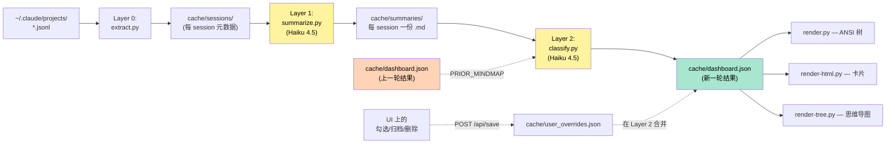
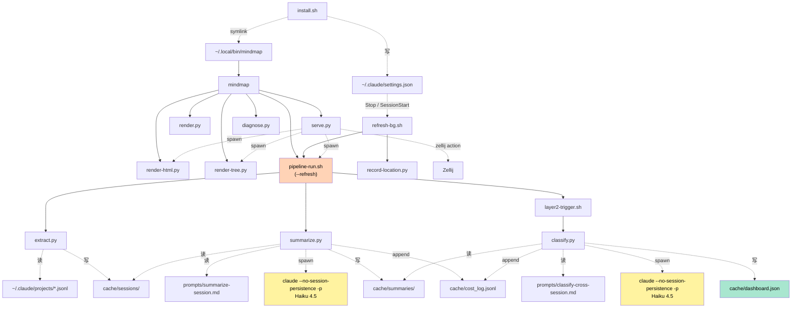
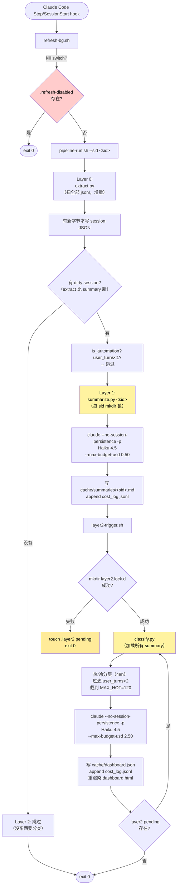
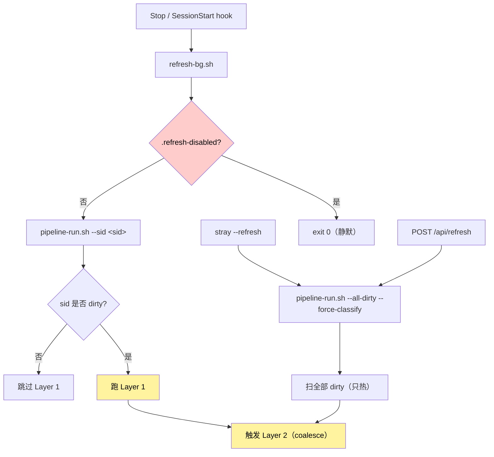
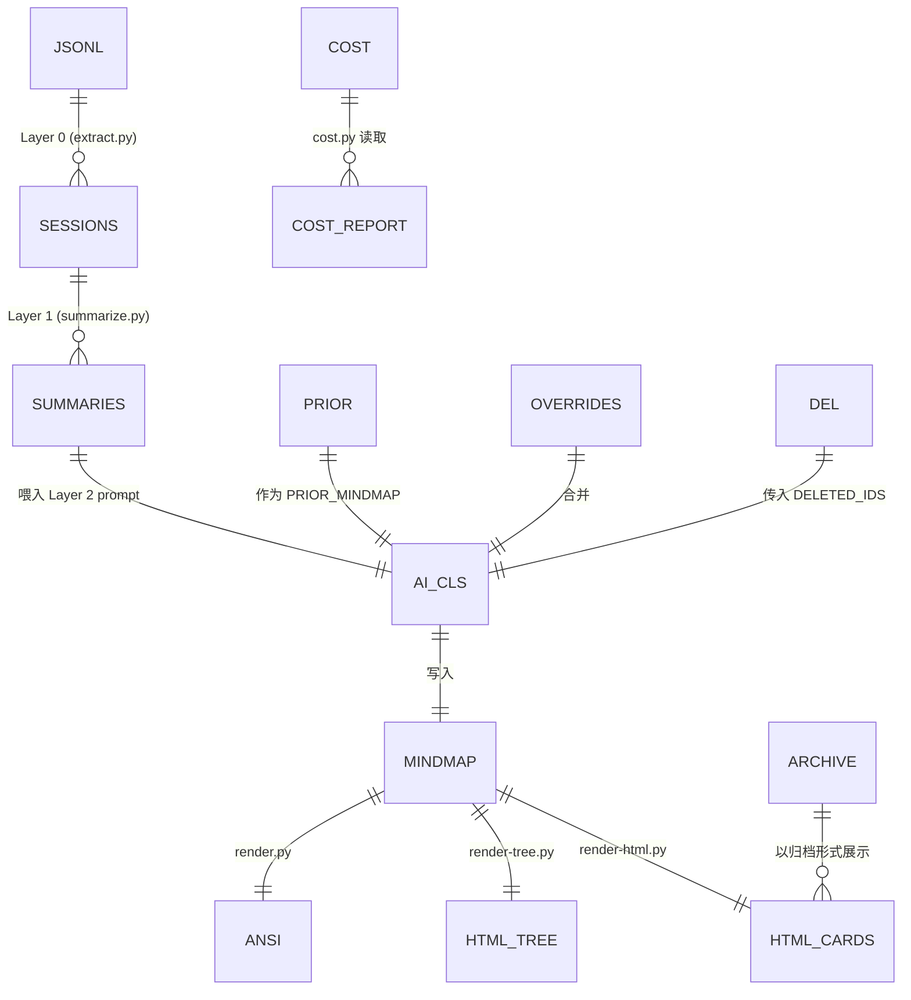
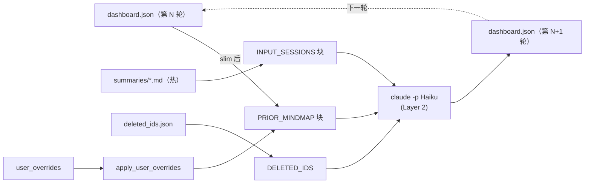
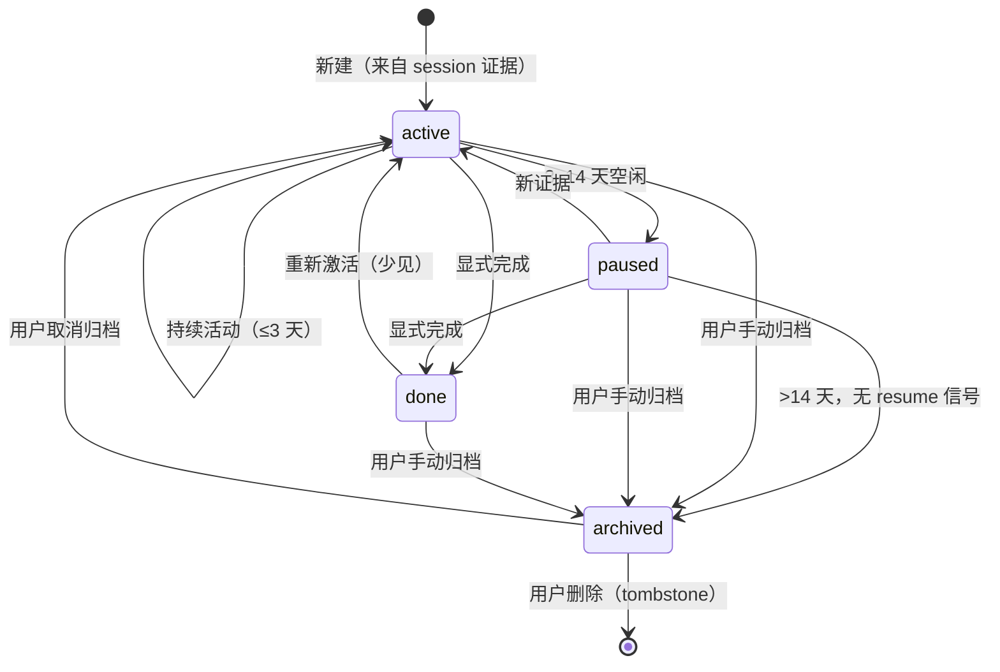

# 架构

> **注意**：英文版已于 2026-06-11 更新，本文件部分内容滞后。以英文版为准。

英文版：[../ARCHITECTURE.md](../ARCHITECTURE.md)

读完这份文档，你应该能够：
- 在 30 秒内向别人讲清楚这个工具的工作原理
- 找到任何一个 cache 文件的写入方和读取方
- 从一个真实用户操作追溯出整条代码路径
- 知道哪里加新功能、哪里改 bug

> 本文已针对 P14/P15 的 3-layer pipeline 重写。早期单脚本架构
> （`refresh.sh` + `aggregate.py`）已在 commit `2ae5071` 退役。

---

## 1. 30 秒看懂

读 `~/.claude/projects/*.jsonl`（Claude Code 自己的会话日志），跑
**两步 Haiku 4.5 pipeline**（单 session 总结 → 跨 session 分类），
把结果落成 `cache/dashboard.json`。主界面是**注意力驾驶舱**
（`bin/cockpit.html`，根路径 `/` 提供）：实时网页面板,按注意力态分带
——**需要你 → 跑着 → 闲置 → 完成**——由 Claude Code hooks 实时遥测驱动,
每张卡可开**内嵌 ttyd 终端**原地 resume 会话。(`/classic` 是旧卡片版;
`stray` 不带参数打印 ANSI 树。)主流水线由 Claude Code 的 Stop / SessionStart
hook 触发(实时)。
派生 AI 功能(tips、周报、下一步建议、wellness)由 `stray --serve`
进程内调度器调度——只有 dashboard 开着时才跑,符合 DD-005 的懒刷新原则。



对比旧的单脚本架构：Layer 0（廉价、按字节增量）跟 Layer 1（按
session AI 总结，可扇出）和 Layer 2（跨 session 分类，coalesce）
解耦了。Layer 1 只对真正变化过的 session 跑；Layer 2 只在某个
Layer 1 真的写了新 summary 后才跑。

---

## 2. 心智模型：三个核心概念

| 概念 | 物理对应 | 谁创建 |
|---|---|---|
| **session** | 一个 jsonl 文件 = Claude Code 的一次会话 | Claude Code 自动写 |
| **initiative** | 一个或多个 session 的逻辑聚合 = "一项工作" | AI 推断（在 Layer 2 classify 阶段） |
| **workspace** | 一个仓库/目录 = initiative 的容器 | AI 推断（通常对应 cwd） |

例子：你在 `~/Code/hsf/hsfops` 里有 5 个 session，分别做
"ChangeFree 重构" 和 "应用文档迭代"，AI 会输出：

- **workspace** `hsfops`
  - **initiative** `hsfops-changefree-cleanup`（5 个中的 3 个）
  - **initiative** `hsfops-app-doc-version-no`（5 个中的 2 个）

一个 initiative 横跨多个 cwd 也允许（如一个特性同时改前端+后端+
SKILL 文件）。AI 会选**最有归属感**的 cwd 当主 workspace，其他记
到 `linked_cwds`。

---

## 3. 仓库目录结构

```
claude-stray/
├── bin/                          # 所有可执行
│   ├── install.sh                # 一次性安装入口（slash + hook）
│   ├── install-hook.sh           # 单独重装 hook 的快捷脚本
│   ├── uninstall.sh
│   ├── mindmap                   # 用户向 CLI 分发器（bash）
│   │
│   ├── pipeline-run.sh           # 3-layer 编排器（核心）
│   ├── refresh-bg.sh             # hook 触发 pipeline-run.sh 的非阻塞包装
│   ├── layer2-trigger.sh         # Layer 2 的 coalesce 包装（mkdir 锁 + pending 标记）
│   │
│   ├── extract.py                # Layer 0: jsonl → cache/sessions/<sid>.json（增量）
│   ├── summarize.py              # Layer 1: cache/sessions/<sid>.json → cache/summaries/<sid>.md
│   ├── classify.py               # Layer 2: cache/summaries/*.md → cache/dashboard.json
│   │
│   ├── record-location.py        # hook stdin → cache/session_locations.json
│   ├── _cost_log.py              # 共享 cost 记录助手（append cost_log.jsonl）
│   ├── cost.py                   # `stray --cost` 报告工具
│   │
│   ├── render.py                 # dashboard.json → ANSI 树 (stdout)
│   ├── render-html.py            # dashboard.json + archive/ + locations → dashboard.html
│   ├── render-tree.py            # dashboard.json → mindmap-tree.html (markmap)
│   │
│   ├── serve.py                  # 本地 HTTP 服务 (127.0.0.1:9876)
│   └── diagnose.py               # 排障工具（stray --diagnose）
│
├── prompts/
│   ├── summarize-session.md      # Layer 1 prompt（单 session 总结）
│   └── classify-cross-session.md # Layer 2 prompt（跨 session 分类）
│
├── commands/                     # /mindmap 和 /mindmap-refresh 模板
│
├── cache/                        # 运行时状态，gitignore
│   ├── config.json               # {lang: zh-CN}
│   ├── dashboard.json              # 主输出
│   ├── dashboard.html              # 渲染产物
│   ├── mindmap-tree.html         # 渲染产物
│   ├── sessions/                 # Layer 0 输出：<sid>.json
│   ├── summaries/                # Layer 1 输出：<sid>.md
│   ├── state.json                # extract 的 byte offset 表
│   ├── cost_log.jsonl            # 每次 AI 调用的成本与 token（append-only）
│   ├── user_overrides.json       # 用户在 UI 上的编辑（待 Layer 2 消费）
│   ├── deleted_ids.json          # 用户主动删除的 initiative tombstone
│   ├── archive/<ws>/<id>.json    # 用户归档的 initiative（AI 永远看不到）
│   ├── session_locations.json    # session → zellij pane 映射
│   ├── .locks/<sid>.lock.d/      # 每 session 的 Layer 1 mkdir 锁
│   ├── .locks/layer2.lock.d/     # 全局 Layer 2 coalesce 锁
│   ├── .layer2.pending           # pending 标记（"当前跑完后再跑一次"）
│   └── .refresh-disabled         # 存在即 kill switch，pipeline 不做事
│
└── docs/                         # 本目录
```

按代码体量排序：`render-html.py`（~1900 行）> `classify.py`（~750）
> `summarize.py`（~420）> `render.py`（~415）> `serve.py`（~380）>
`diagnose.py`（~340）> 其他 <250。

---

## 4. 组件依赖图

谁调谁，谁读写谁。**实线 = 直接调用**，**虚线 = 文件间接**。



两条最重要的路径：

1. **数据采集**：`jsonl → extract.py → cache/sessions/`
2. **AI 分类**：`cache/sessions/ → summarize.py → cache/summaries/ → classify.py → cache/dashboard.json`

---

## 5. Pipeline 深挖

`pipeline-run.sh` 是三层的编排者。Layer 2 通过 `layer2-trigger.sh`
触发，它做 coalesce——把并发的触发合并成一次跨 session classify，
保证安静期内只跑最多一次。



### Layer 0 — `extract.py`

纯文件 I/O。读 jsonl 的新增字节（用 `cache/state.json` 里每文件
的 byte offset），按记录解析、应用到 `SessionSummary`，原子写
`cache/sessions/<sid>.json`。

关键安全网 — `_is_automation_prompt`：如果一个 session 的首条用户
prompt 以 `AUTOMATION_PROMPT_MARKERS` 中任意一个标记字符串开头，
就标 `is_automation`，Layer 1 跳过。标记表必须覆盖 `prompts/` 下
**每一个** prompt 模板的开头句——漏一个就形成递归扩散（见
DD-004 §1 和 2026-05-14 事故复盘）。

### Layer 1 — `summarize.py`

针对每个传给它的 session，用 `prompts/summarize-session.md` 跑
Haiku 4.5。输出是结构化 YAML frontmatter（workspace 推断、status、
blockers、artifacts）+ 一段叙述，保存到 `cache/summaries/<sid>.md`。
每 sid 一把 mkdir 锁防止并发重复工作。

`claude` 参数：
- `--no-session-persistence` — **关键**：阻止这次嵌套调用被记成
  新 jsonl，否则会再次触发 hook 链。
- `--max-budget-usd 0.50` — per-call 硬上限。
- `--disallowedTools "Bash Edit Write Read Glob Grep"` — 纯文本生成。

### Layer 2 — `classify.py`（经由 `layer2-trigger.sh`）

读所有 `cache/summaries/*.md`，分热（最近 48h）/ 冷两层，应用
user_overrides，把 prior dashboard.json + 热 summary 喂给 Haiku 4.5，
写新的 dashboard.json。

`layer2-trigger.sh` 处理 fan-in 合并：如果已经在跑 classify，
新的触发只 `touch` 一下 `.layer2.pending`；当前 classify 写完后
检查这个标记并循环再跑。

两层都 append `cache/cost_log.jsonl`，供 `stray --cost` 读取。

---

## 6. 触发与节流



主流水线触发:

| 来源 | 时机 | 行为 |
|---|---|---|
| `Stop` / `SessionStart` hook | 每次 assistant 回合结束 / 开/恢复 session | `refresh-bg.sh --sid <sid>`,fork+detach,hook 立即返回 |
| `stray --refresh` | 用户命令 | 强制全扫 + 强制 classify,绕过 Layer 2 的 dirty 门控 |
| `POST /api/refresh` | UI 🔄 按钮 | 同上 |
| `cache/.refresh-disabled` | 手动 touch / `stray --pause` | Kill switch — 所有 hook 立即 exit |

派生功能(DD-006,只在 `stray --serve` 进程内调度):

| 来源 | 时机 | 行为 |
|---|---|---|
| serve scheduler — 启动 + 每 6h | tips(4 类内容,header ticker 显示) |
| serve scheduler — tips 同步触发 | wellness 信号检测(无信号则零成本) |
| serve scheduler — dashboard.json mtime 变化 | next-steps 重算(30m 内置去抖) |
| serve scheduler — 周五 12:00 本地 | weekly_report(每 ISO 周一次) |

早期版本有个 2 小时 launchd 兜底任务,在 hook 验证稳定 + DD-005 懒刷新
原则确立后被移除——"永远后台跑点啥"在这个项目里反而是反模式。

**没有全局 cooldown 闸门了**（旧的 `last_ai_run.epoch` cooldown 是
单脚本架构的折衷办法）。每层有自己的节流：
- Layer 1 按 session 做 dirty 门控（mtime 比对）
- Layer 2 由 mkdir 锁 + pending 标记做 coalesce

`--max-budget-usd` 是目前唯一的成本护栏，直到 DD-004 的预算熔断
器实现。

---

## 7. Cache 数据模型



### 样例：`cache/sessions/<sid>.json`

```json
{
  "session_id": "...",
  "cwd": "/Users/bby/Code/hsf/hsfops",
  "started_at": "2026-05-14T08:00:00Z",
  "last_activity_at": "2026-05-14T09:30:00Z",
  "message_count": 12,
  "user_message_count": 6,
  "first_user_prompt": "...",
  "recent_user_prompts": ["...", "..."],
  "edited_files": ["src/A.java", "src/B.java"],
  "tools_used": ["Bash", "Edit", "Read"],
  "task_events": [],
  "last_assistant_summary": "...",
  "is_automation": false
}
```

### 样例：`cache/summaries/<sid>.md`

```markdown
---
sid: ...
workspace: hsfops
title: ChangeFree 重构
status: active
last_activity_at: 2026-05-14T09:30:00Z
user_turns: 6
artifacts:
  - type: mr
    url: https://code.alibaba-inc.com/.../mr/12345
    status: open
    title: ChangeFree v2 实现
blockers:
  - source: external-review
    note: 等 CR 审核中
---

本次会话讨论了 ChangeFree 的核心数据流改造……
```

### 样例：`cache/dashboard.json`

```json
{
  "schema_version": 2,
  "generated_at": "2026-05-14T09:32:01Z",
  "workspaces": [
    {
      "name": "hsfops",
      "cwd": "/Users/bby/Code/hsf/hsfops",
      "initiatives": [
        {
          "id": "hsfops-changefree-cleanup",
          "name": "ChangeFree 重构",
          "status": "active",
          "sessions": ["..."],
          "linked_cwds": [],
          "tasks": [
            {"title": "核心数据流改造", "done": false},
            {"title": "回归测试", "done": false}
          ],
          "artifacts": [...],
          "blockers": [...]
        }
      ]
    }
  ]
}
```

---

## 8. 端到端走查

### 走查 1：一个新 session 变成卡片

```mermaid
sequenceDiagram
    autonumber
    actor U as 用户
    participant CC as Claude Code
    participant BG as refresh-bg.sh
    participant P as pipeline-run.sh
    participant E as extract.py
    participant S as summarize.py
    participant T as layer2-trigger.sh
    participant C as classify.py
    participant FS as cache/

    U->>CC: claude（开新 session）
    CC->>CC: 创建 sid.jsonl（空）
    CC-->>BG: SessionStart hook
    BG->>FS: record-location.py
    BG->>P: fork+detach pipeline-run.sh --sid &lt;sid&gt;
    BG-->>CC: 立即返回

    U->>CC: 发消息
    CC->>FS: append jsonl
    CC-->>BG: Stop hook
    BG->>P: fork+detach
    P->>E: extract.py（Layer 0）
    E->>FS: 读增量字节，写 sessions/&lt;sid&gt;.json
    P->>P: 检测 dirty
    P->>S: summarize.py &lt;sid&gt;（Layer 1）
    S->>S: claude --no-session-persistence -p (Haiku)
    S->>FS: 写 summaries/&lt;sid&gt;.md
    S->>FS: append cost_log
    P->>T: 触发 layer2-trigger.sh
    T->>C: 拿到 mkdir 锁，跑 classify.py
    C->>FS: 加载全部 summary，分类
    C->>FS: 写 dashboard.json，重渲染 html
    Note over U: 浏览器轮询 /api/data
    FS-->>U: 新 mindmap，新卡片可见（classify 完成后 8 秒内）
```

### 走查 2：用户在 UI 上勾选任务完成

逻辑没变 — 见 `bin/render-html.py` 客户端的 `task_toggles`、
`bin/serve.py` 的 `POST /api/save`。服务端把 override 合并到下一次
classify 跑（`classify.py` 的 `apply_user_overrides()`）。
classify prompt 的 done-monotone 规则阻止 AI 把它撤销回去。

### 走查 3：`stray --serve` 启动到出页面

逻辑没变 — 见 `bin/serve.py`。关键设计：
- daemon_threads + worker-thread `shutdown()` 防 SIGINT 死锁
- GET 时 regen-on-the-fly，保持 dashboard.html 跟 dashboard.json 同步
- `/api/data` 8 秒轮询，generated_at 变了就静默 in-place re-render

---

## 9. 连续性模型：PRIOR_MINDMAP 反馈环

让这个工具真正可用的不是"AI 每次都很聪明"，而是**让 AI 在它上次
的输出之上做增量更新**。



`prompts/classify-cross-session.md` 里有 Continuity rules 约束 AI：

1. **稳定 id** — 同一概念性的工作必须复用同一个 id
2. **保守改名** — 任务标题不轻易重写
3. **done 单调** — 一旦 `done: true`，永远 true
4. **冷 initiative 不可变（§5）** — 超过 48h 没活动的 initiative
   必须与 PRIOR 字节一致（只允许 status 衰减）
5. **不删历史任务** — 它们是历史
6. **新条目要有依据** — INPUT_SESSIONS 里要找得到证据

这就是"用户标完成的任务能扛得过 AI 重分类"的原因：AI 看到 PRIOR
里 `done:true`，单调规则禁止改回；如果 AI 飘了，classify.py 的
post-process 会兜底修复。

---

## 10. Initiative 状态机



两种 archived：
- **AI 标归档**（>14 天空闲）— 还在 dashboard.json 里，只是 `status=archived`
- **用户手动归档** — 物理移到 `cache/archive/<ws>/<id>.json`；
  dashboard.json 不再含它。HTML 还能看到因为 `render-html.py` 读
  archive/ 目录

---

## 11. 并发与原子性

锁是层级化的，不再有全局锁：

| 资源 | 锁 | 粒度 |
|---|---|---|
| Layer 0（`extract.py`） | 不需要 | 每次 `pipeline-run.sh` 调用内单进程扫，内容幂等 |
| Layer 1（`summarize.py`） | `cache/.locks/<sid>.lock.d/` | 按 session |
| Layer 2（`classify.py`） | `cache/.locks/layer2.lock.d/` | 全局（同时只一个 classify） |
| Layer 2 fan-in | `cache/.layer2.pending` 标记 | 当前跑完后再跑一次 |
| `user_overrides.json` 写 | 无 | last-writer-wins（~100ms 窗口） |

所有 mkdir 锁都有 stale-lock 清理（`find -mmin +N` 在获取前查），
+ `trap rmdir EXIT` 崩溃时释放。**不用 `flock(1)`**——它是
util-linux 独占，stock macOS 没有（P14 上线踩过的雷，见
[feedback_macos_portability](../../../.claude/projects/-Users-bby-Code-claude-stray/memory/feedback_macos_portability.md)）。

---

## 12. 关键不变式

代码或 prompt 强制保证，违反就是 bug。

1. `cache/dashboard.json` `schema_version == 2`
2. 每个 initiative 都有非空 `id` 和 `sessions[]`
3. `sessions[]` 都是完整 UUID（classify.py post-process 修截断）
4. `done: true` 在多轮 refresh 间不可逆（Continuity 规则）
5. 归档的 initiative 永远不进 PRIOR_MINDMAP（prompt 构造前过滤）
6. 冷 initiative（>48h 空闲）在两轮间字节一致（Continuity §5；
   post-process 兜底修复）
7. `extract.py` 把首 prompt 匹配 `AUTOMATION_PROMPT_MARKERS` 的
   session 标 `is_automation`，Layer 1 跳过。标记表必须覆盖所有
   prompt 模板；漏一个就形成自递归（$51 事故）。
8. Layer 1/2 永远用 `claude --no-session-persistence -p` 调用；
   不加这个 flag，嵌套调用会被记成新 session，hook 链无限递归。

---

## 13. 已知短板

### 13.1 热 summary cap 是硬天花板

`MAX_HOT=120` 限制 Layer 2 每次最多看多少最近 summary。如果哪天
活跃 session 突然 >120，最老的会落入"冷"区域，不再影响新一轮
分类。实际不太遇到；写在这里以防规模变化。

### 13.2 没有实时预算/告警

有 kill switch（`cache/.refresh-disabled`）但没实时告警。今天你
只有手动跑 `stray --cost` 才知道异常。DD-004 规划了日预算 +
速率监控 + 仪表盘 banner，未实现。

### 13.3 没有生命周期控制面

装上以后 pipeline 永远在跑。没有"周末暂停"或"只在我打开仪表盘
时跑"的开关。DD-005 提了 opt-in 生命周期模型。

### 13.4 跨主机/多用户

故意只走 loopback。不远程访问、不协作，也不打算支持。

---

## 14. 学习路径

到这里你已经看完整个系统了。建议下一步：

1. **看自己的状态**：`stray --diagnose` 走一遍所有阶段，看 kill switch / cost / hook 状态
2. **追一个真实 session**：`stray --diagnose <sid>` 看一个具体 session 卡在哪一阶段
3. **读 prompt**：`cat prompts/summarize-session.md`（Layer 1）和 `cat prompts/classify-cross-session.md`（Layer 2）
4. **读 DD**：
   - [DD-002](design/DD-002-ai-pipeline-redesign.md) — 为什么是 3 层
   - [DD-003](design/DD-003-card-detail-and-artifacts.md) — 卡片细节 + artifact 提取
   - [DD-004](../../design/DD-004-circuit-breaker-and-alarm.md) — 预算熔断器（提案）
   - [DD-005](../../design/DD-005-lifecycle.md) — 生命周期 opt-in（提案）
   - [DD-006](../../design/DD-006-card-derived-ai-features.md) — 周报 / AI Tips / 暖心提醒（提案）
   - [DD-007](../../design/DD-007-agent-auto-runner.md) — 卡片级 AI 代理推进（提案）

想深挖某个组件？告诉我。
