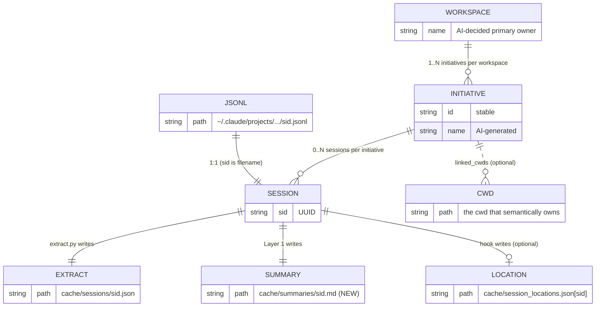
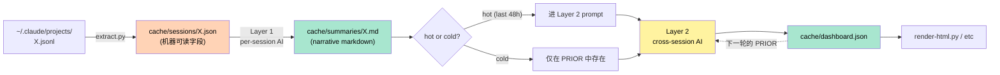
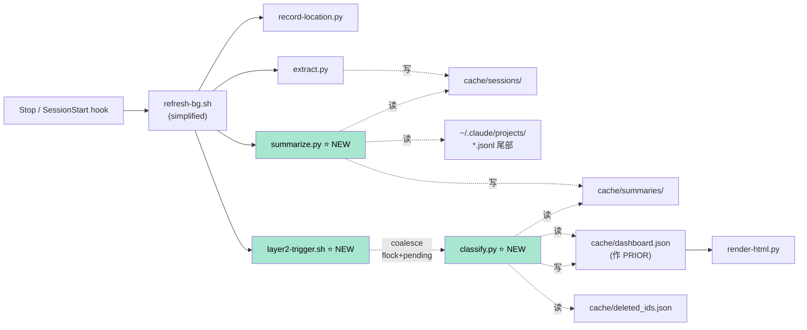
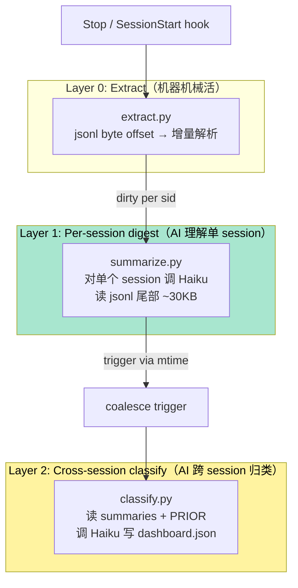
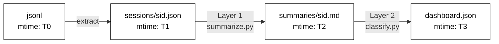
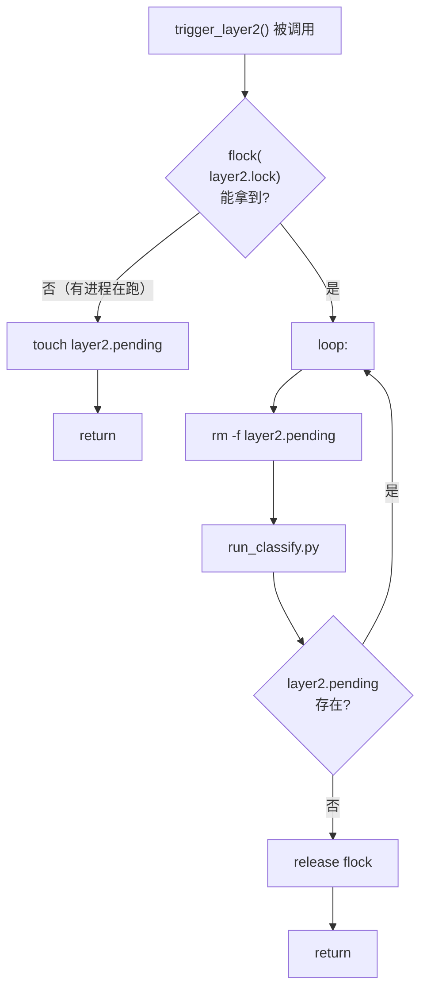
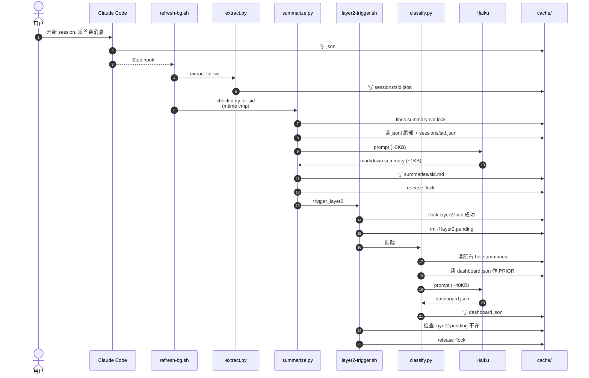
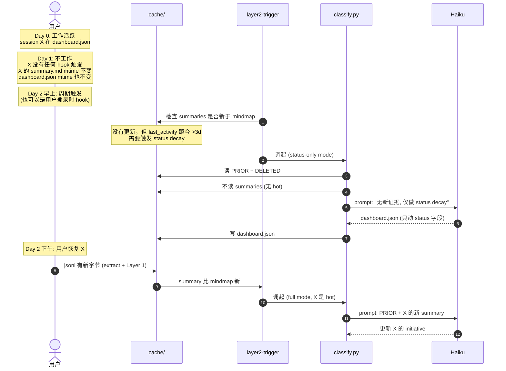
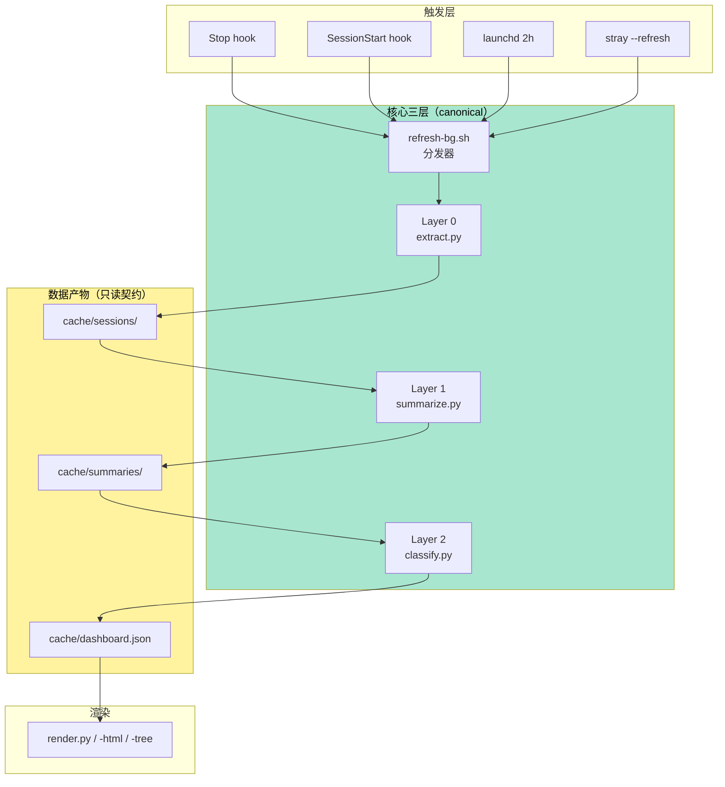
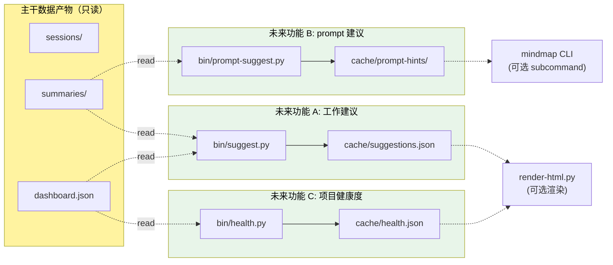

# DD-002: AI Pipeline 重设计

**Status**: Proposed
**Author**: bby
**Date**: 2026-05-14
**Supersedes**: DD-001（两段式分类）—— DD-002 是其完整版

英文原版：[../../design/DD-002-ai-pipeline-redesign.md](../../design/DD-002-ai-pipeline-redesign.md)

> 整合 P13 系列讨论的完整设计。涵盖：核心抽象、文件布局、三层架构、
> mtime dirty tracking、冷热分层、并发模型、数据模型、走查、迁移。

---

## 目录

- [1. 问题集](#1-问题集)
- [2. 核心抽象与映射](#2-核心抽象与映射)
- [3. 文件目录设计](#3-文件目录设计)
- [4. 三层架构](#4-三层架构)
- [5. Dirty Tracking](#5-dirty-tracking)
- [6. 冷热分层](#6-冷热分层)
- [7. 并发模型](#7-并发模型)
- [8. 数据模型](#8-数据模型)
- [9. 端到端走查](#9-端到端走查)
- [10. 迁移方案](#10-迁移方案)
- [11. 风险与回滚](#11-风险与回滚)
- [12. 扩展哲学与契约](#12-扩展哲学与契约)
- [13. 开放问题](#13-开放问题)
- [14. 推进顺序](#14-推进顺序)

---

## 1. 问题集

四个互相纠缠的问题，根因都是 **AI 被要求在一次调用里、用浅信息、
做多种任务、处理远超必要的数据量**。

| # | 问题 | 当前症状 | 当前实现 |
|---|---|---|---|
| A | 全量喂入 | 200 session 每次 refresh 全过 AI，其中 ~190 一动不动 | `aggregate.py` 平等对待所有 session |
| B | 单次 AI 任务过载 | 分组 + 命名 + status + tasks + 连续性 5 件事一锅煮 | 1 prompt + Haiku 全包 |
| C | 没 dirty tracking | 不知道什么变了，只能全量重算 | 粗粒度 `last_input.sha256` |
| D | 信息密度低 | extract 每 session 压到 1.5KB，AI 看不到对话原文 | 多个有损压缩字段 |

实际表现：用户花 90 分钟排查 bug、提了 ISSUE，卡片上仍显示"还在 arthas watch"。
信息根本没传达到 AI 那里。

---

## 2. 核心抽象与映射

### 2.1 三个抽象的关系



**关键关系**：

| 关系 | 基数 | 谁决定 |
|---|---|---|
| jsonl ↔ session | 1:1 | Claude Code（文件名 = session_id） |
| session → initiative | N:1 | AI 推断（在 Layer 2 分类时） |
| initiative → workspace | N:1 | AI 推断（按语义归属） |
| initiative → cwd | 1:1 主 + N linked | AI 选最贴合的主 cwd |

**Card** = HTML UI 上的一个卡片 = 一个 initiative 的可视化。一一对应。

### 2.2 信息流向



---

## 3. 文件目录设计

### 3.1 完整布局

```
cache/                                    # 全部 gitignore
│
├── config.json                           # {lang: zh-CN}
├── dashboard.json                          # 主输出 (schema v2)
├── dashboard.html                          # 渲染产物
├── mindmap-tree.html                     # 渲染产物
│
├── sessions/                             # Stage 0: extract 输出
│   ├── <sid1>.json                       # 机器可读字段
│   ├── <sid2>.json
│   └── ...
│
├── summaries/                            # ⭐ NEW: Layer 1 输出
│   ├── <sid1>.md                         # AI 写的 narrative markdown
│   ├── <sid2>.md
│   └── ...
│
├── state.json                            # extract 的 byte offset 表
├── session_locations.json                # hook 写的 zellij pane 信息
│
├── user_overrides.json                   # UI 编辑的 task done 翻转
├── deleted_ids.json                      # 用户主动删除的 tombstone
├── archive/<workspace>/<id>.json         # 用户归档的 initiative 全量
│
├── .locks/                               # ⭐ NEW: 细粒度锁目录
│   ├── summary-<sid>.lock                # Layer 1 per-sid flock
│   ├── layer2.lock                       # Layer 2 单进程 flock
│   └── layer2.pending                    # Layer 2 coalesce 标记
│
└── (废弃)
    ├── aggregate_input.json              # ❌ Layer 2 直接读 summaries/
    ├── last_input.sha256                 # ❌ 用 mtime 比较代替
    ├── last_ai_run.epoch                 # ❌ 没 cooldown 了
    └── refresh.lock.d/                   # ❌ 锁粒度太粗
```

### 3.2 与代码组件的对应



新增脚本：

| 脚本 | 角色 |
|---|---|
| `bin/summarize.py` | Layer 1：读 1 个 session 的 jsonl 尾部，调 Haiku 写 `summaries/<sid>.md` |
| `bin/layer2-trigger.sh` | Layer 2 触发：用 flock + pending 实现 coalesce |
| `bin/classify.py` | Layer 2：读 summaries + PRIOR，调 Haiku 写 `dashboard.json` |

废弃：

- `bin/refresh.sh` 大幅瘦身（不再包揽所有阶段，只做 apply-overrides + 拉起各 layer）
- `bin/aggregate.py` 不再需要

---

## 4. 三层架构

### 4.1 总览



### 4.2 Layer 0: Extract

**不变**。继续是机械增量解析 jsonl 写 `cache/sessions/<sid>.json`。

变化：可以**简化字段**——既然 Layer 1 会拿 jsonl 原文，extract 的
重压缩字段（first_user_prompt / last_assistant_summary 等）不再被
下游使用。Layer 0 只需要保留**机器信号**：

```jsonc
{
  "session_id": "...",
  "cwd": "...",
  "started_at": "...",
  "last_activity_at": "...",
  "user_turns": 16,
  "edits": [{"file": "...", "kind": "create", "ops": 3}, ...],
  "tools": {"Bash": 12, "Read": 30, "Edit": 3},
  "task_events": ["created: ...", "completed: ..."]
}
```

文本内容（prompts / 回复）**完全交给 Layer 1 处理**。

### 4.3 Layer 1: Per-session digest

**职责**：单个 session → 一份结构化叙述。

**输入**：
- `cache/sessions/<sid>.json` （机器信号）
- `~/.claude/projects/.../<sid>.jsonl` 的**尾部** ~30KB
  （最近 10 个 user-assistant turn 的原文）

**输出**：`cache/summaries/<sid>.md`

```markdown
---
session_id: cbbeb23c-b6f9-4eb4-926e-7e4046c856d4
cwd: /Users/bby/Code/pandora/pandora-sar/hsf
last_activity_at: 2026-05-13T09:19:46Z
user_turns: 16
updated_at: 2026-05-13T09:25:00Z
status_guess: active
---

# 目标
排查 EagleEye 链路追踪服务端 IP 为空的问题。涉及 mtop 入口转 HSF
调用场景下的 span 归属。

# 当前状态
已定位根因：EagleEyeHttpHook.beforeProcess 中 logRemoteIp 传错了
参数（传了本机 IP 而非真正的远端 IP）。修复方案明确。

# 已下的决定
- 修改 EagleEyeHttpHook，从 HSFRequestContext 取真正的 remoteIp
- 对 mtop-uncenter 场景特殊处理（本机调用，源和目标都是本机 IP）

# 产物
- /tmp/aone-issue-hsf-eagleeye.md（已创建，待提交）

# 下一步
提交 Aone ISSUE，指派给自己；开发分支修复 EagleEyeHttpHook。

# 待解决
无（修复方案已明确）

# 任务（建议）
- [x] 收集带 @s0 前缀的 EagleEye data 样本
- [x] 用 arthas watch 抓取现场数据
- [x] 定位根因（EagleEyeHttpHook 传错参）
- [x] 撰写 Aone ISSUE 草稿
- [ ] 提交 ISSUE 到 Middleware RPC 项目
- [ ] 开发修复分支
```

**Prompt 草图**（`prompts/summarize-session.md`，~80 行）：

```
你在阅读 Claude Code 一次完整会话的尾部，目标是产出一份结构化叙述
markdown，供后续跨 session 分类使用。

输入：
  - SESSION_META: 这次会话的元数据（user_turns, edited_files 等）
  - TURNS: 最近 10 轮 user-assistant 的完整文本

输出严格 markdown，包含以下段落（按顺序）：
  # 目标 — 1-2 句话，用户为什么开这个 session
  # 当前状态 — 截至最后一轮，工作站在哪里
  # 已下的决定 — bullet 列表，活到现在的决策
  # 产物 — 编辑/创建的文件
  # 下一步 — 用户或 AI 明示的下一步
  # 待解决 — 挂起的问题
  # 任务（建议） — [x] / [ ] 列表，每条 ≤ 60 字符

规则：
  - 最后一轮 = 最权威信号；recap 和首条 prompt 可能已经过时
  - 如果 session 在闲扯（如 "好的"、"继续"），不要硬挤内容；可写
    "（无有效进展）"
  - status_guess 推断：active（有明确推进）/ paused（中途没接） /
    done（用户确认完成或 ship） / abandoned（看起来放弃了）
```

**触发**：Stop hook → 检查 dirty（见 §5）→ 跑

**成本**：~$0.01 / 次（Haiku, ~5KB prompt, ~1KB 输出，~5-10s）

**并发**：完全并发，per-sid flock。详见 §7。

### 4.4 Layer 2: Cross-session classify

**职责**：所有 hot summaries + PRIOR → dashboard.json。

**输入**：
- `cache/summaries/<sid>.md` 对所有 **hot** session（详见 §6）
- `cache/dashboard.json` 作为 PRIOR_MINDMAP（slim 后）
- `cache/deleted_ids.json` 作为 DELETED_IDS

**输出**：`cache/dashboard.json`（schema v2 不变）

**Prompt 草图**（`prompts/classify-cross-session.md`）：

```
你在做跨 session 分类。把一组 hot session summaries 归类到
initiative，并维护跨刷新的连续性。

输入：
  - HOT_SUMMARIES: 一组结构化 markdown 摘要（来自 Layer 1）
  - PRIOR_MINDMAP: 上一轮的分类结果
  - DELETED_IDS: 用户主动删除的 initiative id（tombstone）

输出严格 JSON: dashboard.json (schema v2)

铁律：
  1. PRIOR 里有、但 HOT_SUMMARIES 没出现的 initiative（cold）：
     只允许动 status（按时间衰减规则）；name/summary/tasks 必须保留 PRIOR 原值
  2. PRIOR 里的 initiative id 必须复用；不允许重命名 id
  3. Task done=true 单调，不能改回 false
  4. DELETED_IDS 里的 id 永远不出现在输出中
  5. session_id 必须是完整 UUID

新增 initiative 仅当 HOT_SUMMARIES 提供新证据且不属于任何已有 initiative
```

**触发**：summaries 比 dashboard.json 新 → 触发 Layer 2（详见 §7 coalesce）

**成本**：~$0.05 / 次（Haiku, ~40KB prompt, ~10KB 输出，~30s）

**并发**：单进程 + coalesce。详见 §7。

---

## 5. Dirty Tracking

用文件 mtime 作为隐式 dirty bit，无需独立标记文件。



判断规则：

| 比较 | 含义 | 该跑什么 |
|---|---|---|
| `T0 > T1` | jsonl 有新字节，extract 滞后 | 跑 extract |
| `T1 > T2` | session 已 extract，但 summary 滞后 | 跑 Layer 1（per-sid） |
| `任意 T2 > T3` | 至少一个 summary 比 mindmap 新 | 触发 Layer 2 |

**规则**：

1. **写文件即承认"我变了"**——只有真正写出新内容时才能更新文件 mtime。
   不允许"无意义写"（如只 bump generated_at 字段）。
2. **比较时取自由**：用 `os.stat().st_mtime`，POSIX 原子读，多进程安全。
3. **崩溃恢复**：进程崩溃后下次启动只看 mtime 即可恢复进度。

**触发逻辑伪代码**：

```python
# Stop hook → refresh-bg.sh → for each session whose jsonl was touched:
def maybe_layer1(sid):
    extract_path = f"cache/sessions/{sid}.json"
    summary_path = f"cache/summaries/{sid}.md"
    if not exists(summary_path) or mtime(extract_path) > mtime(summary_path):
        run_layer1(sid)
        trigger_layer2()   # 见 §7

# layer2-trigger.sh
def trigger_layer2():
    summaries_max = max(mtime(p) for p in glob("cache/summaries/*.md"))
    if summaries_max > mtime("cache/dashboard.json"):
        run_layer2_with_coalesce()
```

---

## 6. 冷热分层

### 6.1 阈值

**Hot session**：`last_activity_at` 在过去 48 小时内。

**Cold session**：其它。

48h 边界：考虑你 ±1 天的工作节奏（开发周末断档常见），48h 足够覆盖
"昨天没碰但今天继续"的场景。

可调，通过 `CLAUDE_WORKTREE_HOT_HOURS=48` env var。

### 6.2 行为对照

| 维度 | Hot session | Cold session |
|---|---|---|
| Layer 1 触发 | 正常（dirty 就跑） | 同左（用户不碰它就不会 dirty） |
| 在 Layer 2 prompt 的 SESSIONS 段？ | **在**（喂 summary） | **不在**（节省 token） |
| 在 Layer 2 prompt 的 PRIOR 段？ | 在（基线） | **在**（保持连续性） |
| AI 可以动其 initiative 的字段 | name, summary, progress, tasks, status | **只能动 status**（衰减规则） |
| 在 dashboard.json 里？ | **在** | **在**（不删除） |
| 在 HTML 卡片上？ | **在** | **在**（可能 status 变 paused） |

### 6.3 强约束：Cold initiative 的 AI 行为

Layer 2 prompt 里要 hammer 这条规则：

```
对于 PRIOR 中存在、但 HOT_SUMMARIES 中没有任何 session 出现的
initiative（即"cold initiative"），你**仅能修改其 status**：

  - 若 last_activity_at < 3 天：保持 active
  - 若 3-14 天：改为 paused
  - 若 >14 天 且没有 resume 信号：改为 archived

name / summary / progress / tasks / sessions 必须**完全等同**于 PRIOR
中的值，逐字符复制。你不能"小幅润色"。
```

### 6.4 hot/cold 边界抖动

担心 session 在 48h 边界附近反复跨越？两种处理：

**方案 A（推荐）**：48h **+ 滞回**。一旦标 cold 需要回归 hot 必须由
"jsonl 有新字节"触发（即用户真的有新活动），不靠 last_activity 自然
回头到 48h 内。

**方案 B**：阈值 + 容差，如 "48h ± 4h 之间用 PRIOR 的标记继续保留
原状态"。复杂度更高，收益微小。

→ 选 A。

---

## 7. 并发模型

### 7.1 Layer 1：per-sid flock，完全并发

```
两个 sid 同时触发：
  Stop hook for sid_A ─► fork ─► flock("summary-A.lock") ─► Haiku ─► done
  Stop hook for sid_B ─► fork ─► flock("summary-B.lock") ─► Haiku ─► done
  
  互不阻塞。
```

同 sid 双触发（罕见）：

```
Stop hook for sid_A (1st) ─► fork ─► flock("summary-A.lock") ── 持锁 ──┐
Stop hook for sid_A (2nd) ─► fork ─► flock("summary-A.lock") ── 阻塞 ─┤
                                                                       ▼
                                                              (1st 完成释放锁)
                                                                       ▼
                                                              (2nd 拿到锁)
                                                                       ▼
                                                          dirty check: 
                                                          mtime(extract) > mtime(summary)?
                                                          若 1st 已写入 → 跳过
                                                          若仍 dirty → 跑
```

锁文件路径：`cache/.locks/summary-<sid>.lock`，flock 排他。

### 7.2 Layer 2：单进程 + coalesce



效果：

| 场景 | 行为 |
|---|---|
| 触发 1 次 | 跑 1 次 → pending 不存在 → 退出 |
| 跑期间触发 N 次 | N 次 touch pending（幂等）→ 跑完后看到 pending → 再跑 1 次 |
| 持续触发 | 永远 ≤ 1 个进程在跑，新触发自动 fold 到下一轮 |

**Cooldown 完全废弃**：

- Layer 1 不需要：per-sid dirty check 已限频
- Layer 2 不需要：coalesce 已限频（永远 ≤ 1 个进程，新触发就排队）

唯一保留可选的"软上限"：每小时 Layer 2 触发不超过 N 次（如 20）。
实测活跃工作时大概 4-6/小时，不需要这个上限。**先不加**。

### 7.3 现有锁的去留

| 锁 | 去留 | 理由 |
|---|---|---|
| `cache/refresh.lock.d/` (mkdir) | **废弃** | refresh.sh 不再是单一编排器 |
| `cache/last_ai_run.epoch` | **废弃** | 没有 cooldown 了 |
| `cache/last_input.sha256` | **废弃** | mtime 比较代替 |
| `cache/.locks/summary-<sid>.lock` | ⭐ 新增 | Layer 1 per-sid |
| `cache/.locks/layer2.lock` | ⭐ 新增 | Layer 2 单进程 |
| `cache/.locks/layer2.pending` | ⭐ 新增 | Layer 2 coalesce |

---

## 8. 数据模型

### 8.1 `cache/sessions/<sid>.json`（Layer 0 输出）

**当前形状瘦身**（详见 §4.2）。只保留机器信号，文本字段全部移除。

```jsonc
{
  "session_id": "cbbeb23c-b6f9-4eb4-926e-7e4046c856d4",
  "cwd": "/Users/bby/Code/pandora/pandora-sar/hsf",
  "started_at": "2026-05-13T07:30:00Z",
  "last_activity_at": "2026-05-13T09:19:46Z",
  "user_turns": 16,
  "edits": [
    {"file": "/tmp/aone-issue-hsf-eagleeye.md", "kind": "create", "ops": 1}
  ],
  "tools": {"Bash": 12, "Read": 30, "WebFetch": 2},
  "task_events": [],
  "is_automation": false
}
```

体积估算：~400 字节 / session（之前是 1.5KB）。

### 8.2 `cache/summaries/<sid>.md`（Layer 1 输出，⭐ NEW）

详见 §4.3。结构化 markdown + YAML frontmatter。

体积估算：~1-2KB / session（密度高，叙事完整）。

### 8.3 `cache/dashboard.json`（Layer 2 输出，schema v2 不变）

不变。

### 8.4 Layer 1 prompt 输入

```
<instructions>
prompts/summarize-session.md 的内容
</instructions>

<session_meta>
{ sessions/<sid>.json 内容 }
</session_meta>

<turns count="10">
最近 10 轮 user-assistant 的完整文本，按时间顺序
</turns>
```

总大小：~5-10KB。Haiku 一次处理 OK。

### 8.5 Layer 2 prompt 输入

```
<instructions>
prompts/classify-cross-session.md 的内容
</instructions>

<context>
  <current_time>2026-05-14T10:00:00Z</current_time>
  <output_lang>zh-CN</output_lang>
</context>

<prior_mindmap>
{ slim 后的 dashboard.json }
</prior_mindmap>

<deleted_ids>
[...]
</deleted_ids>

<hot_summaries count="25">
  <summary sid="cbbeb23c-...">
    （cache/summaries/cbbeb23c-...md 的完整内容）
  </summary>
  <summary sid="...">
    ...
  </summary>
</hot_summaries>
```

总大小：~40-60KB（远小于当前 300KB）。

**Cache 友好顺序**：高频不变的 `<instructions>` 放最前，cache 命中
率最高；`<hot_summaries>` 在最后，每次都变。

---

## 9. 端到端走查

### 9.1 走查 1：新 session 第一次成卡



### 9.2 走查 2：用户在 UI 上勾完成 task

不变（user_overrides 流程不动）。但有一个简化：apply-overrides 不
再 inline 在 refresh.sh 里，可以**直接在 Layer 2 启动前应用**：

```
classify.py 开头：
  1. 读 user_overrides.json
  2. 应用 task done 翻转到 dashboard.json
  3. 清空 user_overrides.json
  4. 读应用后的 dashboard.json 作 PRIOR
  5. 调 AI
```

这样保证 AI 的 PRIOR 总是含最新的用户意图。

### 9.3 走查 3：用户休息一天后回来



**关键**：Day 2 早上的"status decay tick"需要有人触发。两个方案：

- **launchd 每天 1 次**调 `layer2-trigger.sh` —— 简单
- **每次 Layer 2 调用前自检**：扫 PRIOR 里所有 initiative，看是否
  有应该衰减的 → 顺手做了 —— 不需额外调度

→ 选后者。每次 Layer 2 都做 status decay，反正成本固定。

---

## 10. 迁移方案

### 10.1 阶段划分

| 阶段 | 目标 | 是否可独立 ship |
|---|---|---|
| Phase 0 | 备份当前 cache + 写迁移脚本 | 必备 |
| Phase 1 | Layer 1 上线（summarize.py + summaries/）；Layer 2 还是单段 | **可** |
| Phase 2 | Layer 2 重写（classify.py 读 summaries）；保留旧 refresh.sh 路径作 fallback | **可** |
| Phase 3 | 启用冷热分层 | **可** |
| Phase 4 | 启用 coalesce + 删除 cooldown / refresh.lock.d | **可** |
| Phase 5 | 删除 legacy（aggregate.py / 旧 prompt） | 收尾 |

每阶段独立 commit + 一周 baking。任何阶段出问题，git revert 回滚。

### 10.2 一次性 backfill

第一次切到 Layer 1 架构时，要给所有 200 个 session 跑一次 Layer 1：

- 200 × $0.01 = **$2 一次性**
- 可在 install.sh 加 `--migrate-summaries` flag，用户主动触发
- 跑期间 dashboard.json 不动，UI 仍然显示老数据
- 跑完后 Layer 2 用新 summaries 做第一次分类

### 10.3 prompt 替换

`prompts/classify.md` 不直接删，改名 `prompts/legacy-classify.md`
保留两周作为 fallback / 对照。新 prompt：

- `prompts/summarize-session.md`（Layer 1）
- `prompts/classify-cross-session.md`（Layer 2）

---

## 11. 风险与回滚

| 风险 | 影响 | 缓解 |
|---|---|---|
| Layer 1 prompt 质量不达标 | summary 写得糊涂 → Layer 2 分类质量退化 | 在 3 个真实 session 上 hand-tune prompt 直到主观满意；先 side-by-side 跑一周对比 |
| Layer 2 prompt 改写 break 连续性 | initiative id 漂移、task 丢失 | 保留 legacy 路径作 A/B；DIFF 监控 id 改名次数 |
| Cold initiative 被 AI 误删 | 卡片消失 | prompt 写死铁律 + 自检段落；Layer 2 输出 schema 加 "preserved_cold_ids" 必填字段强制 AI 列出来 |
| Coalesce bug 导致死锁 | Layer 2 不再触发 | flock 自动随进程崩溃释放；pending 文件 stale 检测（如 >1h 自动 rm） |
| Backfill 太贵或太慢 | $2 + 5-10 min 等待 | 可分批 backfill；或允许 Layer 2 在 backfill 进行中正常跑（缺 summary 的 session 暂时不参与分类） |

### 回滚路径

每个 Phase 都通过 git revert 回退；cache schema 兼容：

- summaries/ 目录可以保留，不影响 legacy 路径
- dashboard.json schema 不变，render 一切正常
- 用户感知：回滚后变回老的卡片质量，无数据丢失

---

## 12. 扩展哲学与契约

DD-002 不只是当前 pipeline 的设计，也是未来所有 AI 功能扩展的脚手架。
这一节明确这套架构的设计哲学、核心不变量、和新功能接入的契约。

### 12.1 设计哲学（6 条原则）

#### 原则 1：File-as-contract（磁盘数据产物即接口）

每一层产出的是**磁盘上的稳定文件**，不是函数返回值。下游层读文件，
不读上游内存。

| 好处 | 代价 |
|---|---|
| 多进程天然安全 | 略多 I/O |
| 崩溃自然恢复（mtime 是状态） | 略多磁盘占用 |
| 易调试（`cat`、`ls -lt` 就是诊断工具） | |
| 函数签名可自由重构，文件 schema 才是真契约 | |

#### 原则 2：Single-writer per file（单写者原则）

每个 cache 文件**有且仅有一个写者脚本**。读者可以无限多，但写者只能
一个。

```
cache/dashboard.json      ← classify.py 写（唯一）
cache/summaries/X.md    ← summarize.py 写（唯一，per-sid）
cache/suggestions.json  ← suggest.py 写（唯一，未来）
```

理由：多写者 = 竞争 + schema 漂移 + 责任不清。一旦允许多写，后续每个
功能都觉得"我也能加一笔"，文件就成杂烩。

#### 原则 3：mtime as universal dirty signal（mtime 作普适脏位）

所有"X 是否过时"的判断都用 `os.stat().st_mtime` 比较。**不维护独立的
dirty flag 文件**。

```
T0: jsonl mtime
T1: cache/sessions/<sid>.json mtime
T2: cache/summaries/<sid>.md mtime
T3: cache/dashboard.json mtime
```

新功能也应当遵守：用自己的输出文件 mtime 判断是否需要重跑。

副作用红利：`ls -lt cache/` 直接告诉你 pipeline 的"健康度"。

#### 原则 4：Graceful degradation（优雅降级）

缺数据产物 = **功能不可用，永不崩溃**。

| 场景 | 期望行为 |
|---|---|
| cache/dashboard.json 缺失 | render-html 显示"还没有数据"，提示运行 refresh |
| cache/summaries/X.md 缺失 | Layer 2 把 X 当 cold 处理，不报错 |
| cache/suggestions.json 缺失 | HTML 不渲染建议角标，主视图正常 |
| 新功能整个未启用 | render-html 完全不知道它存在，正常工作 |

#### 原则 5：Rule of Three for abstractions（三例原则）

**不要为一个、两个用例提抽象。等出现第三个雷同 case 再提**。

理由：

- 1 个用例时你不知道哪些是 essence、哪些是 incident
- 2 个用例时容易被表面相似性骗（看似 pattern，其实差异更大）
- 3 个用例时 essence vs incident 清晰可辨

适用候选：

| 候选 helper | 需要 N 个用例后再提 |
|---|---|
| `bin/_ai_call.py`（Haiku 调用封装） | 第 3 个调 Haiku 的脚本 |
| `bin/_dirty.py`（mtime 比较） | 第 3 个用 dirty tracking 的功能 |
| `bin/_coalesce.sh`（flock + pending） | 第 3 个需要 coalesce 的脚本 |
| `bin/_cache_writer.py`（atomic 写） | 第 3 个有 atomic 需求的写者 |

DD-002 落地后第 1、2 个 AI 调用是 Layer 1 / Layer 2，第 3 个出现时
（可能是 suggest.py 之类）才开始提 helper。

#### 原则 6：Hooks as triggers, not callbacks（hook 只是触发器）

Stop hook、SessionStart hook 应当**fire-and-forget**——立即返回，
不等待结果。

```
hook fires → refresh-bg.sh fork-and-detach → exit (< 100ms)
                                    ↓
                          后续 Layer 0/1/2/etc. 在后台跑
```

新功能**不允许在 hook handler 里同步阻塞**。所有重活通过 mtime dirty
tracking 异步触发。

### 12.2 核心链路（Canonical pipeline）

这是**不可被新功能修改**的主干。任何新功能必须**作为并行支路**接
入，不能在主干上插一脚。



**主干上的不变量**（重申，参考 [§12 关键不变量](../ARCHITECTURE.md#12-关键不变量)）：

1. dashboard.json schema_version == 2
2. session_id 是完整 UUID
3. Task done 单调
4. Archived initiative 不进 PRIOR
5. cache/last_ai_run.epoch（DD-002 后废弃）由专门 marker 标记真实 AI 跑过的时间

### 12.3 扩展契约（新功能必须遵守的 6 条）

任何新 AI 功能（如工作建议、prompt 建议、健康度分析）接入时，必须：

| # | 契约 | 形式化 |
|---|---|---|
| 1 | **只读主干产物** | 只读 `cache/sessions/`、`cache/summaries/`、`cache/dashboard.json`；不写、不改 schema |
| 2 | **独立数据产物** | 写到 `cache/<feature>/` 或 `cache/<feature>.json`；自己的目录自己管 |
| 3 | **独立 prompt 文件** | `prompts/<feature>.md`；不复用、不修改 `classify-cross-session.md` 等主干 prompt |
| 4 | **同套并发模型** | 用 DD-002 的 mtime dirty + flock + coalesce；不发明新机制 |
| 5 | **独立 cost budget** | 在 config.json 声明 `<feature>.budget_per_hour`；不蹭主干预算 |
| 6 | **渲染层降级** | render-html.py 把新功能当 enhancement；产物缺失时主视图照常 |

任何违反这 6 条的扩展都应当被 review 拒绝。如果你强烈觉得某条契约需要
打破，**先开 DD 讨论修改契约**，不要在功能 PR 里偷偷破。

### 12.4 未来功能接入示意



具体 3 个例子（仅 sketch，不在 DD-002 范围）：

**A. AI 工作建议**

```
bin/suggest.py:
  触发: cron 每小时一次 / stray --suggest
  读:   cache/summaries/*.md（hot 的） + cache/dashboard.json
  prompt: prompts/suggest.md
          "基于这些 initiative，给我下一步该做什么的 5 条建议"
  写:   cache/suggestions.json
        [{init_id, priority, suggestion, rationale}, ...]
  成本: ~$0.03/call
  渲染: HTML 卡片右上角 💡 角标，点击展开
```

**B. Prompt 建议**

```
bin/prompt-suggest.py:
  触发: SessionStart hook
  读:   cache/summaries/<相关 sids>.md, cache/dashboard.json
  prompt: prompts/prompt-suggest.md
          "基于这些类似的过去 session，推荐 3 个 prompt 起点"
  写:   cache/prompt-hints/<新 sid>.md
  成本: ~$0.01/call
  渲染: 用户在 Claude Code 里 /hints 读
```

**C. 项目健康度**

```
bin/health.py:
  触发: launchd 每天 1 次
  读:   cache/dashboard.json
  prompt: prompts/health.md
          "分析每个 initiative 的健康度：阻塞 / 缓慢 / 健康"
  写:   cache/health.json
  成本: ~$0.05/day
  渲染: HTML 顶部 banner "X 个阻塞项目"
```

三个功能都遵守了 6 条契约，互不打架，互不依赖。

### 12.5 反模式（明确不能做的事）

| 反模式 | 后果 | 应该怎么做 |
|---|---|---|
| 给 dashboard.json 加新字段（如 `suggestions: [...]`） | 多写者竞争；schema 膨胀；解析错乱 | 写到 `cache/<feature>.json`，render 时合并展示 |
| 改 `cache/summaries/<sid>.md` 加新段 | Layer 2 看到污染；其它消费者 confused | 写到 `cache/<feature>/<sid>.md` |
| 复用 Layer 2 的 prompt 加自己的 instruction | Prompt 失控膨胀；Haiku 输出质量下降 | 独立 prompt 文件、独立 AI 调用 |
| 直接 import extract.py 内部函数 | 重构 extract 时多调用方耦合 | 通过文件契约消费它的输出 |
| 为新功能加新的全局锁 | 多套并发模型互相打架 | 用 DD-002 同款 flock + coalesce |
| 让新功能在 Stop hook 里同步阻塞 | hook 响应慢，用户感知到延迟 | fork-and-detach，让 mtime 触发后续 |
| 给新功能加自己的 launchd plist | 多个独立调度任务，难管理 | 通过 refresh-bg.sh 路由 |
| 新功能写 dashboard.json mtime | 误触发 Layer 2 重跑 | 只 mtime 自己的产物 |

### 12.6 全局风险与缓解

| 风险 | 当前对策 | 未来加强 |
|---|---|---|
| 累计 AI 调用 cost 失控 | 每个 layer 独立 cooldown / coalesce | config.json 加 `feature_budgets` 段；超限拒绝触发 |
| 多个功能抢 Stop hook 资源 | refresh-bg.sh 统一路由 | 任何 hook 配置只指向 refresh-bg.sh |
| 数据竞争 | 单一 writer 原则 | 通过 review 把关 |
| 启动顺序依赖 | 优雅降级原则 | 通过 review 把关 |
| 配置爆炸 | env vars + config.json | 第 3 个新配置需求时统一成 yaml/toml |
| 磁盘空间 | summaries/ 长期增长 | GC 策略：>30 天未动且 initiative archived 的 summary 删除 |
| 突发流量 | coalesce 已限频 | 第 3 个高频功能时再上软上限（如全局每小时 AI 调用 ≤ 50 次） |

### 12.7 什么时候 review / 升级契约

契约不是一成不变。在以下时机考虑修订：

- **3+ 个功能都想做同一件被禁止的事**——说明契约有 gap，需要补条款
- **某条契约从未被违反**——说明它可能多余，可以放松
- **新功能依赖现有功能的输出**——形成 feature 间依赖链。第 1 次允许
  （Feature B 读 Feature A 的产物，不读它的内部）；第 2 次开 DD 评估
  要不要把 A 升级到"准核心"
- **Anthropic API 变化**（如新模型、新 cache 机制）——可能要改主干，
  顺便重审契约

每次契约修订都通过新的 DD-N 走流程，更新本 §12，不在功能 PR 里偷改。

---

## 13. 开放问题

### 12.1 已对齐（结合之前讨论）

| 决策 | 结论 |
|---|---|
| Dirty tracking 用什么 | **mtime 比较**，无独立 flag |
| Cold session 在 dashboard.json | **保留**，只是不进 Layer 2 prompt 的 SESSIONS 段 |
| AI 对 cold 能动什么 | **仅 status decay**；name/summary/tasks 不能动 |
| Layer 1 并发 | **完全并发**，per-sid flock |
| Layer 2 并发 | **单进程 + coalesce** |
| Cooldown | **全部废弃** |
| 冷热阈值 | **48h**（可 env 调整） |
| 冷热抖动 | **滞回**：只有 jsonl 新字节才能 hot 回来 |

### 12.2 待你拍板

1. **Layer 1 prompt 看多少轮 / 多少 KB**？目前提议 10 轮 OR 30KB
   先到为准。短 session 看完整，长 session 截尾部。可调。

2. **summary markdown 段落是否固定**？提议 7 段（目标 / 当前状态 /
   决定 / 产物 / 下一步 / 待解决 / 任务）。要不要更精简（如合并成 4 段：
   目标 / 状态 / 下一步 / 任务）？精简的好处是 AI 更少做选择，但
   信号量也少。

3. **触发 layer2-trigger.sh 的位置**：
   - A. 每个 Layer 1 完成时调一次（写完 summary 立刻试）
   - B. refresh-bg.sh 末尾统一调一次（一次 hook 多个 sid 时合并）
   B 更省，A 更即时。

4. **status decay 在哪做**：
   - A. classify.py 开头扫 PRIOR 主动做（每次 Layer 2 必跑）
   - B. 单独的 maintenance 脚本周期性跑
   A 更简单，每次 Layer 2 多扫一遍 PRIOR 几乎免费。倾向 A。

5. **summary 失败时怎么办**：
   - A. 用旧 summary（mtime 不更新）
   - B. 在 .md 文件里写"FAIL: <error>"占位
   - C. 不写文件，下次重试
   A 最不影响 Layer 2，但旧数据可能误导。C 最干净但要重试逻辑。
   倾向 A + 错误写到 log。

6. **大文件清理**：summaries/ 目录会无限增长。session jsonl 被删时
   要不要也删对应 summary？或定期 GC （> 30 天没更新且 initiative
   已 archived 的）。低优先级，先不管。

---

## 14. 推进顺序

按风险 / 成本权衡，建议这个顺序：

```
Step 1  写 prompts/summarize-session.md 并用 3 个真实 session 调试
        （成本: ~$0.03, 时间: 1 小时迭代）

Step 2  实现 bin/summarize.py（Layer 1 完整逻辑）
        含 dirty check / per-sid flock / 写 summaries/
        （成本: 半天编码）

Step 3  Backfill: 对所有现有 session 跑 Layer 1
        （成本: ~$2 一次性, 5-10 分钟）

Step 4  写 prompts/classify-cross-session.md
        （成本: 半天）

Step 5  实现 bin/classify.py（Layer 2 完整逻辑）+ layer2-trigger.sh
        （成本: 半天）

Step 6  side-by-side 跑 1 周
        同时跑老 refresh.sh 和新 pipeline，对比 dashboard.json DIFF
        （成本: ~$5/天 × 7 天 = ~$35，可接受）

Step 7  切换 hook 指向新 pipeline，关掉老路径
        （成本: 5 分钟改 settings.json）

Step 8  baking 1 周，观察

Step 9  删除 legacy（aggregate.py, refresh.sh 大瘦身, 旧 prompt）
```

总工作量：~3 天专注编码 + ~2 周 baking。
